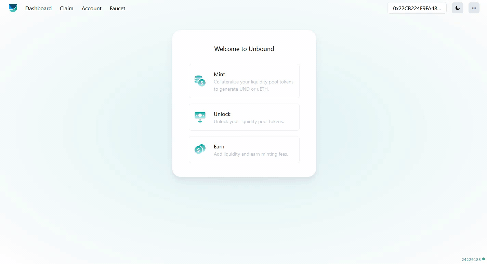

# Block Limit Lock Mechanism  - A Security Layer

Block Limit Lock Mechanism\(BLLM\) is one of the key features of the protocol to secure it from flash loans that occur within a span of a single transaction. Unbound being built on LPTs from AMMs was especially susceptible and BLLM is a security protection mechanism where the user has to wait at least three to five blocks confirmation to interact again with the SCs. The block limit lock implementation has been done in Unbound’s liquidity lock contracts \(LLC \) and block limit can be changed or removed any time as per market conditions.

User previously interacted with Mint and wants to interact again at the same time  then user has to wait at least five blocks confirmation 

Similarly, for unlock user has to wait at least five block confirmation to perform unlock again  

Once the sufficient number of blocks have elapsed then the user can perform mint or unlock as per the requirements

