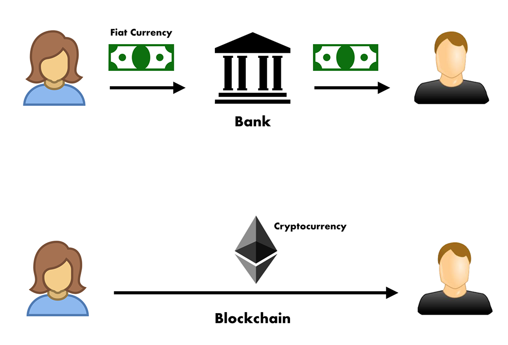
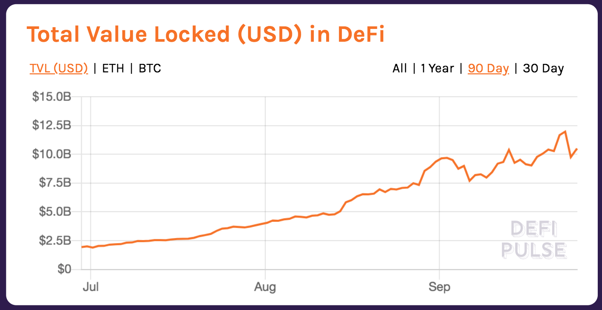
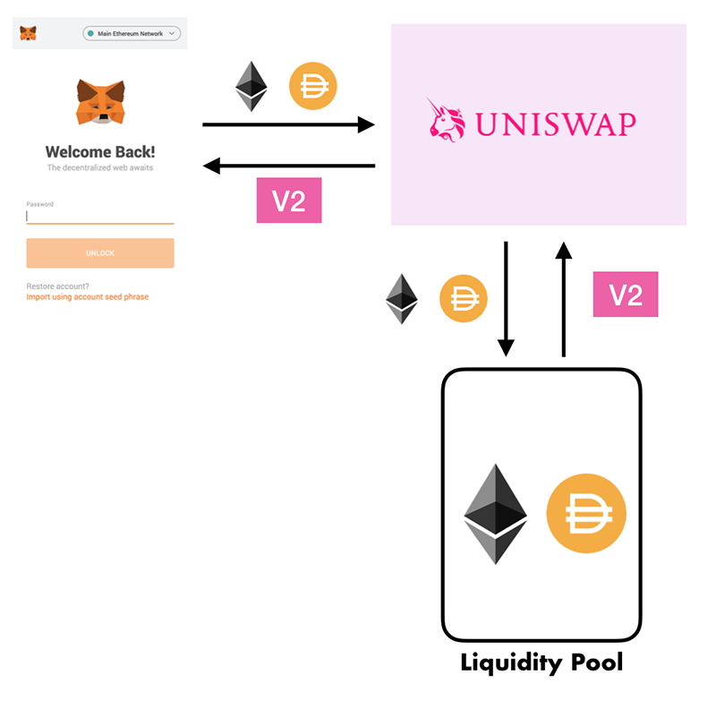
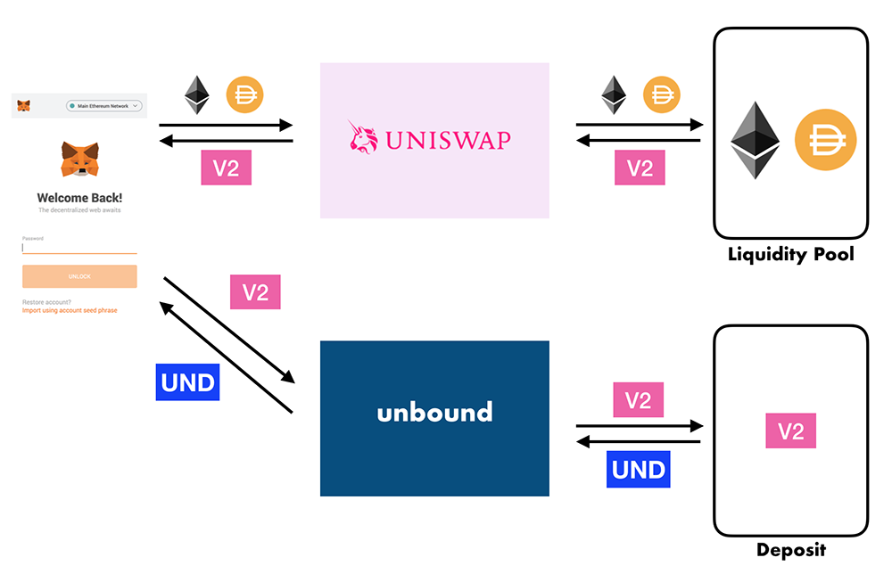
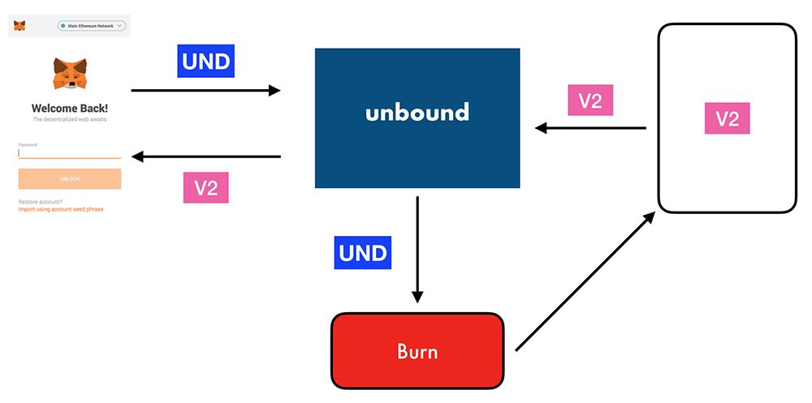
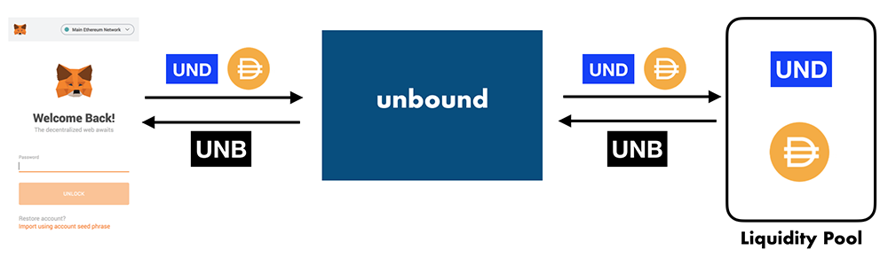
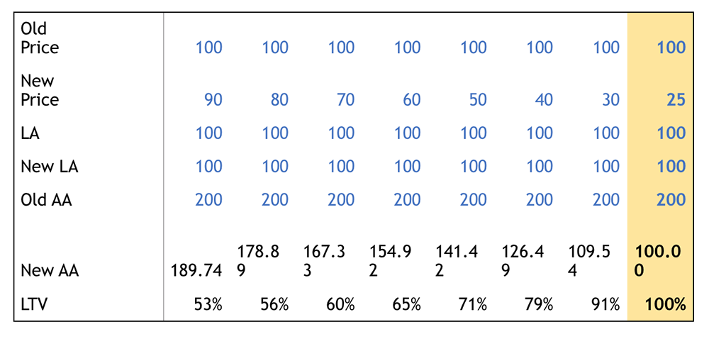
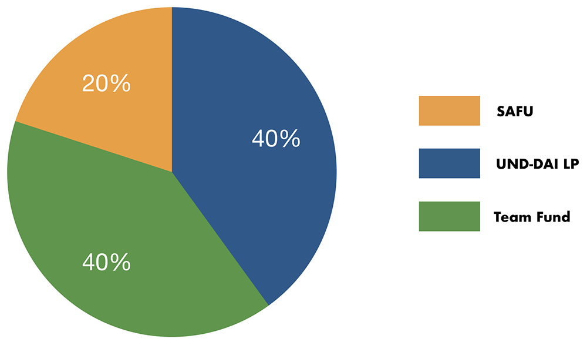
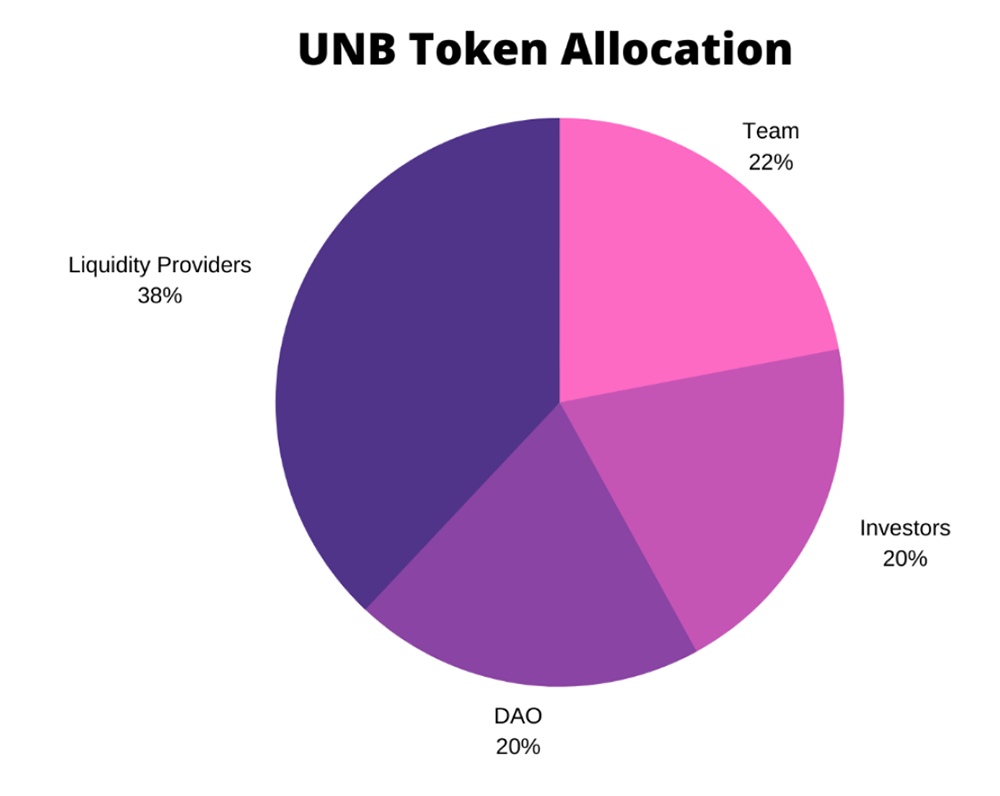

# White Paper

## Abstract

This white paper explains Unbound's DeFi \(Decentralized Finance\) protocols. There are two protocols used on the platform. The first is for unlocking liquidity from existing AMM \(Automated Market Maker\) pools and issuance of the UND stablecoin. The second protocol is for governance and earnings for Liquidity Providers to the Unbound pool with the UNB token. These protocols are the heart of Unbound's trustless and secure platform for open financing with no sign-up or registration required.

‌We begin with a brief background of cryptocurrency, blockchain and DeFi to understand the market and how it relates to the Unbound protocols. Smart Contracts and AMM will be framed along the narrative of the DeFi industry. The benefits of market making and Liquidity Pools will be discussed, along with known issues that users must be aware of. Unbound will then present their vision of how to get the most in unlocking the DeFi markets for money making opportunities.

‌The core features used in the protocol will be explained regarding token minting, unlocking liquidity and earning from the Unbound pool. Minting provides users the ability to borrow from deposited LPT \(Liquidity Pool Token\) that is locked in a Smart Contract. When users can pay back the amount borrowed, the Smart Contract unlocks and releases the LPT. During the time the LPT is locked, it still earns for the user from their Liquidity Pool. The earn feature provides users with governance tokens when they contribute to the Unbound Liquidity Pool.

‌Finally the distribution of fees will be discussed, along with the platform's governance protocol. A breakdown of how the collected minting fees are allocated will also be explained, regarding its purpose and benefits to the users. The governance protocol, tokenomics and token allocation will then be discussed and how it helps form an efficient and secure community-led market-driven platform.   

## Introduction

The DeFi market is full of new possibilities in providing market creation, without relying on a bank or middle-man to facilitate transactions. There are instead innovative platforms that allow direct P2P \(Peer-to-Peer\) transfer of value and payments. This has been made possible by blockchain technology, providing a _trustless_ and _permissionless_ way to transact in a decentralized network. The platforms that provide these services only facilitate users and do not have control over who can transact. All that is required is a digital wallet which stores the user's private key to authorize transactions. The transactions are then handled by Smart Contracts and AMM \(Automated Market Makers\), which will be explained in the following sections.  

### Cryptocurrency And Blockchain

[Cryptocurrency](https://www.investopedia.com/terms/c/cryptocurrency.asp) encompasses a digital asset class that can be used as a medium of exchange, form of payment and store of value. Unlike fiat currency \(i.e. cash\), it is an electronic form of currency \(also called virtual currency\) that has no physical counterpart. The value is stored in an open and distributed database called the[ blockchain](https://www.investopedia.com/terms/b/blockchain.asp). It has no central authority or organization, making it decentralized so that there is no one entity that controls the database. The blockchain can be open to the public because it was meant to be transparent. At the same time it is immutable, meaning no one can tamper with the data once it is written to the blockchain. The data is secured cryptographically through hashes, so bad actors will not be able to reverse the recorded transaction once it has been committed. Hashes are a one way cryptographic function that converts the data into a fixed length output recorded on a blockchain. Cryptocurrency is also designed to be counterfeit-resistant since the blockchain prevents what is called double-spending through transaction confirmations by the network.  
‌

Users access their cryptocurrency using their digital wallets \(e.g.[ Metamask](https://metamask.io/)\). These wallets do not actually store any cryptocurrency. This uses a system called a Public Key Infrastructure \(PKI\). The cryptocurrency, which represent the value of what a user owns, are stored on the blockchain.‌ The most compelling feature of cryptocurrency and the blockchain, is its support for P2P transactions. This allows users to make direct payments to each other without the use of a bank or intermediary. Without mediation, users are like their own bank. There are no payment processors involved who charge high fees and no one can censor users from making transactions. This is the benefit of decentralization, where each user can interconnect with other users using a public network running the same software version. It does not require permission to access the network and connect directly with other users. The users do not need to know each other, which makes transactions trustless but secure with cryptography.  

To illustrate an example, let us say that Alice wants to pay Bob. She would have to release funds from her bank account in order to make  payment. The bank functions as an intermediary in the transaction. The bank has a policy which it implements, and they can block a transaction or even censor the account. This is an example of how traditional payment systems work in the finance sector. With cryptocurrency there are no intermediaries. Using the blockchain to facilitate transactions, Alice pays Bob directly without the permission or trust that an intermediary like a bank provides.

Bitcoin and Ethereum are the two most popular cryptocurrency in the market. Bitcoin makes up 58% \($198 Billion\) of the total $341 Billion cryptocurrency market valuation \(Source [Coinmarketcap](https://coinmarketcap.com/) as of September 25, 2020\). Ethereum comes at second with 11.4% \($39 Billion\) of the cryptocurrency market. They both use blockchain networks to store data with cryptographic security. Each cryptocurrency have their own digital wallet format which provide users their private key and unique addresses. Ethereum relates most to the DeFi space since DApps  run on the Ethereum blockchain. This is where Ethereum based tokens, which are used mostly in DeFi, are traded. 

### DeFi

[Decentralized Finance](https://www.entrepreneur.com/article/353588) or DeFi is a sector of the cryptocurrency market. DeFi provides a way to access digital assets using non-traditional financial instruments that don't rely on centralized institutions like banks and brokerage firms. The idea is to  promote a more open system that circumvents exclusion from financial services while allowing users to have control of their money. There is a huge potential in this market based on the general data gathered about the amount of Total Value Locked \(TVL\) amounting to $10.42 Billion USD as of September 25, 2020 \([DeFi Pulse](https://defipulse.com/)\).

The DeFi market consists of the following \(Data from September 25, 2020 - DeFi Pulse\)

* **Lending Platforms** -  They make up 41% of the total value locked with $4.35 Billion. These systems allow users to borrow against their collateral \(e.g.  Compound, Aave, dYdX, Oasis, MakerDAO, Dharma\).  
* **Decentralized Exchanges** **\(DEX\)** - Consists of 39% of the total value locked with $4.12 Billion.The foundation of cryptocurrency trading, where exchanges or swaps are conducted on decentralized platforms \(e.g. Uniswap, EtherDelta, Bancor\). These include converting one token to another \(e.g. ETH for DAI\).  
* **Assets** - Provides 11.8% of total value locked with $1.24 Billion. These include digital assets like WBTC, YFI and Ren. 

* **Derivatives** - Contributes 6.5% of total value locked with $677.8 Million. These are platforms \(e.g. Synthetix\) that use contracts to derive its value from an underlying asset or entity's performance.  
* **Payments** - Contributes 1.7% of total value locked with $183.8 Million. These consist of payment platforms like Flexa \(Ethereum\) and the Lightning Network \(Bitcoin\).

Some of the value in DeFi are locked in Liquidity Pools. According to [Coinmarketcap](https://coinmarketcap.com/yield-farming/), over $3 Billion are locked in these pools. These pools consist of [ERC-20](https://www.investopedia.com/news/what-erc20-and-what-does-it-mean-ethereum/) tokens which are locked in Smart Contracts. ERC-20 refers to the technical standard for issuing tokens on the Ethereum blockchain. These tokens have a wide variety of uses from lending to payments. It is these tokens that are being traded on DeFi platforms. The total value locked is quite enormous as a money market. Such value can be viewed as untapped potential for further money making opportunities when unlocked.

### Smart Contracts

Smart Contracts are one of the innovations that are used in the DeFi space. It was originally introduced as part of the Ethereum protocol which allows the execution of agreements with conditions that can be performed programmatically. It was developed as a way to address the shortcomings of the Bitcoin protocol in providing an application development platform on the blockchain. With smart contracts, business processes like payments and loans can be put into code and executed on a distributed and decentralized network of computers. Transactions are verified through a consensus mechanism that is then recorded on the blockchain, where it is made transparent for accountability and secured from tampering.

DeFi makes use of Smart Contracts on the Ethereum blockchain through decentralized exchanges which  provide more options for liquidity in the market. The Ethereum blockchain charges a fee called _gas_, which is a unit of computation for executing Smart Contracts. This fee is a form of incentive to computers on the blockchain network to process a transaction. It is all decentralized in nature and uses an open platform available for everyone to use. This allows trades without the hefty requirements for financial inclusion like bank accounts or trading licenses. This opens up greater reach and flexibility, through an automated process. 

### Automated Market Makers \(AMM\)

In DeFi, the constant flow of liquidity is handled by AMM \(Automated Market Maker\). The AMM function is  to allow traders to keep financial markets flowing. The AMM are an innovation in the sense that they do not require order books to match with buy and sell orders to fulfill a transaction. The main function of AMM  platforms in the DeFi space is to provide funds to what are called Liquidity Pools. These pools lock value using Smart Contracts to provide liquidity for enabling token pair exchanges. In return the users, also called Liquidity Providers, are issued an LPT \(Liquidity Pool Token\) that represents the value they put into the Liquidity Pool. 

An example of an AMM is the platform called [Uniswap](https://uniswap.org/). Users provide their liquidity as the Liquidity Provider to a Liquidity Pool. To provide liquidity, the users must have an ETH and ERC-20 token pairing to lock in the Smart Contract. An example of a token pair is ETH and DAI. The Liquidity Provider must deposit ETH and an equivalent amount of DAI. In return the user makes money from yields, also referred to as Yield Farming. While it is locked, it can earn from a 0.3% transaction fee on the Liquidity Pool. The more a user contributes to a pool, the greater the returns for fees collected. Uniswap then issues their V2 LPT to the user as a receipt of their claim to contributions put in that pool. In the Liquidity Pool, there are enough ERC-20 tokens to swap and send with other pools. When users want to remove their liquidity from a pool, this allows them to withdraw all their funds.

The disruption this brings to the finance industry is that transactions can be automated using a Smart Contract. Before automation, the quantity and price of assets were handled by order book systems. They matched buy and sell orders in the market, usually requiring a broker or third party to facilitate the transaction. AMM were developed to bring more liquidity without human manipulation. This was originally done algorithmically by brokerage firms using specialized computer software. Then came the use of the blockchain and Smart Contracts to automate the process in which digital assets can be automatically swapped against a pool’s latest prices. It also removes the third party from facilitating transactions. The benefits are these efficiency gains made from using an AMM. 

### Known Issues In Liquidity Pools

In a Liquidity Pool,  users have to make equivalent values of their token pairs. For example, Ethereum \(ETH\) and the ERC-20 token that is locked in the Smart Contract. If the user wants to join an ETH/DAI Liquidity Pool on Uniswap, there must be an equal amount of ETH and DAI. If 1 ETH is equivalent to 100 DAI, then if the user wants to enter the pool with 2 ETH they must provide the equivalent amount of DAI which is 200. When someone comes in and decides to trade DAI to ETH, the liquidity will be affected. 

This can lead to temporary price volatility that leads to an impermanent loss. The loss is only considered temporary until it returns to its original market value. The problem is that it can become permanent if the user withdraws or if the price doesn't return to the original market value. This can occur when the prices tilt in favor of either ETH or DAI.

When there is a demand to trade ETH in exchange for DAI, the DAI liquidity might decrease while ETH liquidity increases. If DAI increases up by a dollar, the ETH must also increase by that margin. This is how the Uniswap Liquidity Pool works using a constant product value that must maintain a balance in the token pairs value. This is the reason why users on AMM may notice a loss in their token value compared to just holding the tokens.

Another issue is slippage, which occurs when there is a difference between the expected price of a trade and the price at which the trade is executed. This can occur with stablecoin tokens, which are pegged to stable currencies to counter price volatility on the market. However, price mismatches in the market can still occur that affects the stability of these tokens. This is why platforms will need to have a set price that is adjusted to the market demand to correct this problem. 

## Vision Statement

Our primary goal is to push the frontiers of DeFi to become more flexible, autonomous and available to users. Unbound is focusing on becoming a DeFi treasury for LPT. This provides new avenues for users to earn and invest their digital assets. Unbound aims to provide a protocol for users to unlock their existing liquidity and to earn more. This will allow participants to mint and unlock liquidity using the Unbound platform. This is through the issuance of the UNB governance token and the UND stablecoin. This provides a protocol for larger money market creation.

Users can unlock their LPT by providing it as collateral from which they can borrow funds. When Liquidity Providers pool digital assets to token pairs, they receive their LPT. The LPT represents a pro-rata claim of what they provided to the pool. The LPT can be deposited to a platform protocol that can lock it into a Smart Contract as collateral to allow the user to borrow funds from it. At the same time, users can continue to collect fees on their LPT Liquidity Pool. Unlocking the liquidity introduces a more diverse opportunity in the market for unique tokens that make up different assets.

Our first product is minting stablecoins from depositing LPT \(Liquidity Pool Tokens\) as a collateral. Unbound allows their users to deposit their tokens from AMM pools as collateral for funding in UND tokens. This offers users the chance to unlock their digital assets and borrow from it to use for their own purposes. No questions are asked and no other requirements are needed, just collateralized digital assets. The next product allows users to reclaim their locked LPT. As long as users can pay back the funds they borrowed, they can claim their LPT. 

We also offer a product to allow users to earn from the liquidity market. To earn on the platform, users can contribute to the Unbound Liquidity Pool and participate in governance as well by receiving the UNB token. These DeFi services are available to all participating users without requiring any registration or sign-up. Overall, we aim to open new avenues for earnings and investments without affecting our participant's existing liquidity pools.

We want to take the direction of a vAMM \(Virtual Automated Market Maker\) and open financing protocol. The vAMM is a constant product price engine that aims to address the shortcomings in many AMM Liquidity Pools and decentralized exchanges, like leverage, shorting, slippage and impermanent loss. The vAMM is like a virtual machine to the user, that provides on-chain liquidity at guaranteed prices. This will improve the liquidity process for users to earn the most from their digital assets. It will also be made more autonomous, providing users a service that is available from anywhere, at any time and any day.  

## Core Features

Unbound provides three main services for users. These are the platform's very own features available from the application. These services are Smart Contracts which are fully automated, not requiring any evaluation from a live agent or entity. The Smart Contracts make sure that the LPT is valid first before a transaction can be created.

### Minting

**UND tokens** are minted when users provide their LPT as collateral. When an LPT is deposited to the smart contract, users can borrow funds at a specified supply. At the moment Unbound supports LPT from Uniswap, Balancer, Mooniswap and Bancor. Future plans to support more LPT will be announced.

The UND minting is determined by:

**UND = Unbound Stablecoin  
LPT = Liquidity Pool Token  
LTV = Loan-to-Value Percentage  
50 = Funding Rate \(50%\)**

**Minted UND = Locked LPT x \[ \(Total Stablecoin Liquidity x LTV Percentage\) / \(LPT Total Supply x 50\) \]** 

The UND token represents the Unbound stablecoin that is pegged to the value of the LPT. When a user deposits their LPT, they can borrow from it an amount of UND. The UND is minted at a set value and charged a minting fee that is to be paid back along with the borrowed funds. 

The Loan-to-Value \(LTV\) ratio is the percentage of funds users can borrow against their collateral. With ETH \(Ethereum\) the LTV is set to 50% \(current\). If ETH is worth $100, users can borrow up to 50 DAI for every 1 ETH. That would be the equivalent of 50 UND \(as pegged to the DAI in the LPT\).

On top of that, there is a minting fee charged to the user. The rate of the minting fee is 0.3% or 0.003 \(rounded to nearest thousandth\).

**mFee = Minting Fee  
r = Rate \(0.3% or 0.003\)  
Minted UND = The UND Amount The User Can Borrow From Their Collateral**

**mFee = r x Minted UND**

**Total Minted UND = Minted UND + mFee**

Once users have their UND, they can use the funds immediately.

### Unlocking

When users pay back their borrowed funds, the UND is destroyed during the burning process. This takes the minted UND out of circulation and in return the user get their LPT. This requires paying back the borrowed funds which included the minting fee.

Unbound smart contracts are perpetual in nature, meaning they don't have a maturity date on the money that has been borrowed. They can still continue earning on their LPT while it is deposited with Unbound. Users also don't have to meet a deadline to repay the funds. 

Unlocking LPT is expressed by:

**bUND = Borrowed UND Amount + mFee  
mFee = Minting Fee**

**Unlock LPT = bUND** 

When the user returns to unlock their LPT, they will see the amount of LPT equivalent to the amount of UND with the minting fee from the value of borrowed funds.

There will be no additional fees charged to users when they unlock their LPT.

### Earning

Users can become Liquidity Providers for the Unbound UND/DAI Liquidity Pool. In doing so they must deposit an equal amount of UND and DAI to add liquidity. In return, the **UNB token** will be issued to the user for providing liquidity. The UNB token will also be used for the governance of the Liquidity Pool by the Unbound community.

This follows the constant product  model:

**X = DAI  
Y = UND**

**k = X x Y**

Trades must not change the product of constant **k,** based on the token pair the user deposited. 

Users earn from transaction fees based on their percentage contribution in the pool. With a 0.3% transaction fee, users can expect to earn a share from the entire pool based on the proportion of their liquidity. This does not mean users earn 0.3% from each transaction, but rather from their share of the entire pool.

For user earnings:

**E = Earnings  
p = User's Percentage Of Liquidity Pool  
t = Transaction  
n = 0.3\(t\) \(Fees Collected\)  
x = Last Term of Fees Collected  
Sum of Fees Collected = ∑ \( n1 + n2 + … + nx \)**

**E = p\(Sum of Fees Collected\)**

For example, if a user's share of the pool’s liquidity is 30% \(0.30\), they will earn 30% of the total fees collected. The more a user provides liquidity, the greater their share of earnings.

## Loan-to-Value Ratio \(LTV\)

These graphs will explain the LTV more specifically.

  
In the above calculations:

* The initial price of asset 1 is assumed to be 100 and the price is falling to various levels \(refer 2nd row in the above table\)
* Since asset 2 is a Stable coin, its price remains constant throughout at 100
* The old Asset Amount is asset 1 + asset 2 = 200
* The Loan Amount \(LA\) is constant at 100, whereas the Asset Amount keeps changing as the price of asset 1 changes.
* LTV is the ratio of new Loan Amount to new Asset Amount.
* As can be observed from above, the LTV keeps increasing as the price keeps falling.
* Asset 1 needs to be corrected by 75% to reach the LTV of 100% and the liquidation point 
* Liquidation point would be slightly higher 
* Unbound will have Liquidation Engine to cover the risks of volatile pairs 

## Tokens

The Unbound protocol uses two tokens for the issuance of funds \(i.e. borrowed money\) and for platform governance. They are the UND stablecoin and UNB governance token.

### UND

The UND \(Unbound Dollar\) is a stablecoin that is pegged to the collateral's digital asset. The value of the UND is minted, based on the value of the deposited LPT. The amount of UND minted at the time the LPT was deposited is the amount that the user must pay back to get their LPT. The UND, after it has been minted, pegs its value to what was issued. When converted to fiat currency, its value will be worth that of the currency it was converted from the exchange. For 1800 UND minted, it can be exchanged for $1800 USD.

When the token is minted, there will be a 0.3% minting fee taken from the minted UND. For example, a supply amount of 1 from the locked LPT is worth 18.973.  Therefore a supply of 2 is valued at 37.947 UND. If the supply from the LPT is 100, the total UND that can be minted from it is 1897.366. The total of 1897.366 UND includes the 0.3% minting fee of 4.7425. When the user repays the borrowed funds, the amount of UND is burned and the LPT is unlocked from the Smart Contract...

### UNB

The UNB \(Unbound Token\) is issued to Liquidity Providers of the Unbound Pool and is the governance token of the platform. To become a UNB holder, users need to provide liquidity to the Unbound Liquidity Pool of UND/DAI pairing. Users will provide a 50/50 split of DAI and its eguivalent amount of UND. Once the amount is indicated an estimated monthly earning is given to the users  of how much they can expect.

The UNB token is issued to users, allowing them to participate in the digital governance of the platform. The token is also a receipt, that represents how much value of the pool a user holds based on their contribution. It also encourages participation from the token holders for making decisions and resolving issues. Token holders will be able to vote for policy on proposed changes and implementations to better serve the community and increase the efficiency of the protocol. The more claims a user has to the pool, based on their contribution, the more voting power they hold in making decisions on the platform. 

## The Unbound Liquidity Pool

Unbound has created a Liquidity Pool for stablecoin token pairing like UND-DAI. This locks the token pair into a Smart Contract for facilitating trades for Unbound's UND and the DAI digital asset. In essence, this will provide an automated service for exchanging UND without the need for order book systems. Users can always trade without waiting for a counterparty to buy or sell an order. These transactions are all handled by the Smart Contract.

Using stablecoins in the Liquidity Pool is by design. The Liquidity Providers in the pool are better protected from slippage and impermanent loss since the stablecoins are pegged to a single price valuation.  This counters market volatility in which divergence in prices can lead to significant losses, even if it is temporary. Since stablecoin prices are for the most part consistent, trades can continue with the market through price discovery with less chances for arbitrage. Due to arbitrage, traders can begin selling the price of one asset as it becomes more valuable on other exchanges. It can still occur, but the Unbound Liquidity Pool aims to minimize that risk.

As a reward for Liquidity Providers, a portion of the 0.3% \(0.003\) transaction fee is split proportionally. This transaction fee is distributed to the Liquidity Providers in proportion to their contribution to the pool's size. Users who have provided the highest liquidity, get a higher proportion of the pool's transaction fees \(discussed in Earning section under Core Features\). Each user who provides liquidity will earn:

**E = Earnings  
p = User's Percentage Of Liquidity Pool  
n = Fees  
x = Last Term  
FeesCollected = ∑ \( n1 + n2 + … + nx \)**

**E = p\(FeesCollected\)**      

**‌**If the summation of the fees collected in the entire pool totals 500, and the user's contribution **p** is 30% or 0.30 then:

**E = 0.30\(500\) = 150**  

## Fee Distribution

The fees collected from minting is broken down as follows:

**a\) SAFU Fund \(40%\)  
b\) UND-DAI Liquidity Pool \(40%\)  
c\) Team Fund \(20%\)**  
  
_**D = Total Fees Distributed**_  
_**tF**_ **= Total Fees Collected  
S = SAFU   
LP = UND-DAI Liquidity Pool  
TF = Team Fund**

_**D**_ **=** _**tF**_**\(SAFU + LP + TF\)  
   = SAFU\(**_**tF**_**\) + LP\(**_**tF**_**\) + TF\(**_**tF**_**\)**

### SAFU

The SAFU \(Secure Asset Fund for Users\) is Unbound's version of an emergency fund in case the protocol encounters the unexpected. Bugs, cyberattacks and other unfortunate events can occur which can affect liquidity sources. The SAFU aims to cover these events as a form of insurance policy to protect funds and mitigate against disaster. 

### UND-DAI Liquidity Pool

A portion of the fees are distributed as a liquidity incentive to the Unbound UND-DAI pool Liquidity Providers. With these fees, it can be used to offset the moments when there are variations in exchange rates. It helps to rebalance the token pairings by minimizing the differences. With extra liquidity, it is always helpful to users who invest in the assets of their choice.

### Team Fund

The remaining portion of the fees are distributed to team members and investors. It is also to pay for the staff and operating expenses on the platform. This allocation is not fixed on the platform.  As the system becomes more autonomous, the portion will shrink until the point where the only expenses will be for operations \(e.g. network, storage, etc.\).

## Governance

The Unbound governance model provides UNB token holders to participate in policies and protocol decisions on the platform. This is part of the community-led effort of Unbound to give their users a part in the decision making process. The amount of UNB tokens that a user holds is proportional to their _voting power_ on the platform. The voting power of a user is like the amount of privilege they have when it comes to policy making, proposals and recommendations for improving the efficiency and performance of the platform. This can include making changes to the token policies for UNB, increasing transaction fees, addition of collateral types to token pairings in Liquidity Pools as well as new improvement proposals for protocols to implement on the platform. It will be the community of token holders who decide what is best. 

There is a token allocation for UNB that is broken down into the following:

**a\) Liquidity Providers \(38%\)    
b\) Team \(22%\)   
c\) Investors \(20%\)  
d\) DAO \(20%\)**

The DAO \(Decentralized Autonomous Organization\) is for an autonomous operation of the platform. These consist of Smart Contracts that form the backend of the platform, including developers and software engineers. It maintains the transaction records and rules that must be implemented on the blockchain for Unbound's protocols. Tokens allocated for the DAO are more for financing the platform, since the Smart Contracts do not vote. The UNB tokens are stored by the DAO, and new policies and improvement proposals from the community can release the tokens to fund projects for the platform.

In Unbound's governance, token holders can collaborate to draft a proposal. The proposal is drafted from a platform feature in the Unbound app website. To recommend an improvement, a token holder drafts the proposal for the community to vote upon. Token holders then _lock_ a certain amount of tokens to proposal  Smart Contract to cast their vote. The amount of tokens locked by a user represents their number of votes \(1 vote is 0.001 UNB token\).  Users can lock their tokens in support of a proposal by being 'in favor', while those who oppose the proposal will lock their tokens for 'not in favor'. The more tokens locked by users in favor than against, the higher the vote count. Only votes of token holders who participated will count, since a no vote does not automatically mean 'not in favor'.  
  
**Y = 'In Favor'  
X = 'Not In Favor'  
T = Total Number of Votes**

**Y = No. of Votes In Favor / T  
X = No. of Votes Not In Favor / T**

**Y = X  
  
If Y &gt; X, Proposal Approved  
If Y &lt; X, Proposal Rejected**

A majority vote of at least 51% of the amount of votes determines whether the proposal will be approved. For example, if there is an overwhelming amount of locked UNB out of the total UNB locked tokens, then the proposal will be approved or rejected and announced to the community. Upon approval, the proposal will be sent to the DAO for implementation. A rejected proposal does not affect the platform, but will be documented as part of the governance process.

If there is a possibility of a draw _\(Y = X\)_, the tie breaker will be determined by 3 random community members who have not voted. This is to ensure that there will be no tie, with a 2/3 majority decision. The voting platform will initiate a special random function to select 3 user addresses who have not voted. The criteria for fairness is:

* Users can cast only 1 vote each, no matter how much voting power they own
* If all 3 users vote 'in favor', then the proposal will be approved
* If all 3 users vote 'not in favor', then the proposal will be rejected
* If 2 out of 3 vote 'in favor' or 'not favor', their decision determines the result

The random selection process will continue until all 3 votes for the tiebreaker have been cast. A timer will be set with a countdown on the user to vote. If a user does not vote within the selected time, then another user address must be selected.

## Conclusion

Unbound is a protocol to unlock money making opportunities in DeFi. The platform allows LPT holders to deposit their digital assets as collateral for borrowing Unbound's UND stablecoin. The platform also issues its native UNB token as an LPT that represents their proportional share of Unbound's  Liquidity Pools. This also grants users who provide liquidity with voting rights for digital governance for implementations to improve the platform's efficiency and performance. Unbound will eventually become a decentralized autonomous platform using vAMM, for providing the best guaranteed price discovery in the market. This provides an open community-led market driven approach to liquidity in non-traditional financial markets.

## References

1. DeFi Explained: Automated Market Makers - '[https://medium.com/multi-io/automated-market-makers-amm-breakdown-d3338f027230](https://medium.com/multi-io/automated-market-makers-amm-breakdown-d3338f027230)'
2. What Is DeFi - '[https://www.coindesk.com/what-is-defi](https://www.coindesk.com/what-is-defi)'
3. The Great Potential Of Decentralized Finance in 2020 - '[https://www.entrepreneur.com/article/353588](https://www.entrepreneur.com/article/353588)'
4. What Is Automated Market Making And Why Does It Matter - '[https://digitexfutures.com/blog/what-are-automated-market-makers-and-why-do-they-matter/](https://digitexfutures.com/blog/what-are-automated-market-makers-and-why-do-they-matter/)'
5. How Do Liquidity Pools Work? DeFi Explained - '[https://medium.com/@finematics/how-do-liquidity-pools-work-defi-explained-6d3418ea71fa](https://medium.com/@finematics/how-do-liquidity-pools-work-defi-explained-6d3418ea71fa)'
6. What Is ERC20 And What Does It Mean For Ethereum - '[https://www.investopedia.com/news/what-erc20-and-what-does-it-mean-ethereum/](https://www.investopedia.com/news/what-erc20-and-what-does-it-mean-ethereum/)'
7. Curve Finance Is Fixing Stablecoin Slippage on DeFi - '[https://cryptobriefing.com/curve-finance-fixing-stablecoin-slippage-defi/](https://cryptobriefing.com/curve-finance-fixing-stablecoin-slippage-defi/)'
8. Beginner’s Guide to \(Getting Rekt by\) Impermanent Loss - '[https://blog.bancor.network/beginners-guide-to-getting-rekt-by-impermanent-loss-7c9510cb2f22](https://blog.bancor.network/beginners-guide-to-getting-rekt-by-impermanent-loss-7c9510cb2f22)'

