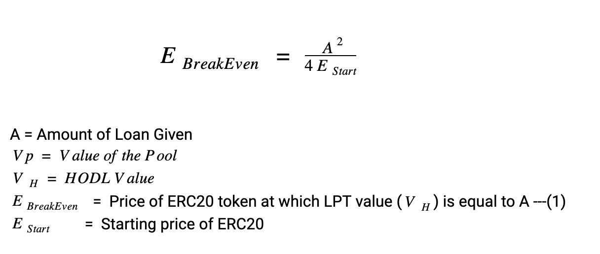

# Whitepaper

## Abstract

Building the next money lego through unlocking the TVL \(Total Value Locked\) within the DeFi system.

Unbound sets out to solve the following problems:  

* Locked liquidity contained in AMM pools  
* High demand but lack of options for a decentralized stablecoin
* Users having their collateral liquidated due to extreme price wicks caused by market volatility 

This white paper is a summary and an explanation of how Unbound Finance solves these problems in a decentralized, trustless and secure manner.

## Introduction

Unbound is a Decentralized Finance \(DeFi\) platform that works on the derivative layer of Automated Market Makers \(AMMs\). Unbound enables users to unlock liquidity from other platforms such as Uniswap, Balancer, Curve, etc. The platform provides synthetic assets such as UND, a USD pegged decentralized stablecoin, uETH an Ethereum pegged erc20, and other synthetic assets that have Liquidity Pool Tokens \(LPTs\) as collateral.  

Some of the key features and objectives of Unbound are to:

* Provide a debt-free liquidity provision system.
* Unlock liquidity from existing AMM pools.
* Create UND \(a USD-pegged decentralized stablecoin\) and other synthetic digital assets.
* Be a treasury for LPTs
* Solve the problem of loan liquidations
* Establish LPT’s as an improved collateral

### What is DeFi?

‌Decentralized Finance \(DeFi\) is a financial system built on decentralized assets. The DeFi ecosystem comprises lending and borrowing, decentralized exchanges, and derivatives trading among other facilities.   

The DeFi market consists of many innovations such as:  

* Lending Platforms - Compound, Aave, dYdX, Oasis, MakerDAO, Dharma etc.
* Decentralized Exchanges \(DEX\) - Uniswap, EtherDelta, Bancor.
* Assets – Digital assets such as WBTC, RenBTC etc.
* Derivatives - Dai, Synthetix etc.
* Payments – Platforms such as Flexa \(Ethereum\) and the Lightning Network \(Bitcoin\).

In October 2020, the total value locked in DeFi in USD is $10.71 Bn. Uniswap alone dominates 23% of the market share. 

[Defi Pulse](https://defipulse.com/)  

### Automated Market Makers \(AMM\)

‌AMM is an implementation of Decentralized Exchanges \(DEXs\). AMMs replace the existing exchange order-books with a permissionless liquidity pool run by algorithms. In DeFi, the constant flow of liquidity is handled by AMMs. Smart contracts lock tokens in order to provide liquidity which enables token pair exchanges. In return, the users, also called Liquidity Providers, are issued an LPT \(Liquidity Pool Token\) that represents the value they put into the Liquidity Pool. 

## Unbound: A Derivative for AMMs

DeFi is evolving with various derivative layers and AMMs are building new smart contract based legos. Unbound is a DeFi platform that creates a treasury layer on top of existing AMM platforms by using LPT’s as a collateral, which is a decentralized receipt of the user’s funds in an AMM pool.    

Unbound provides the first-ever debt-free liquidity provision system! The platform provides liquidity to AMM LPTs and issues a Stablecoin \(UND\) in the form of a minted token. The platform unlocks the LPTs once the UND is returned, irrespective of time. The user is never at risk given that Unbound does not have a Liquidation Engine!  

1. Unlock LPT Liquidity: LPTs are the ideal collateral. They are great for funding but unsuitable for trading. Unbound will collateralize LPTs via smart contracts, which provide additional liquidity, without compromising on security.
2. Mint Stablecoin by locking LPTs: Unlock will lock LPTs and mint a stablecoin \(UND\).
3. No Liquidation Engine for LargeCap Pairs\(Eth/Dai,USDT/USDC,etc\) : Unbound does not have a liquidation engine. The smart contracts unlock collaterals whenever the minted UND is returned. What this imply is that when you mint UNDs, this does not create a debt position where:
   1. Users do not lose any collateral amount
   2. Unbound does not charge any penalty amount if the value of collateral goes below a certain amount.
4. SAFU fund: In case of an exceptionally steep decline in collateral value, the SAFU fund is there to absorb some or all of the losses without liquidating the user collateral. More details in the following sections.

## Core Features

‌Unbound provides three main services in the form of fully automated Smart Contracts that do not require any third party intervention. The Smart Contracts make sure that the LPT pool is valid before a transaction can be created.

### ‌Minting

‌UND tokens and other synthetic assets are minted when users provide their LPT as collateral. The UND token represents a stablecoin pegged to the value of USD. Once users have their UND, they can use the funds immediately. Unbound will initially support LPTs from various AMMs such as Uniswap, Balancer, Mooniswap, Curve, Kyber, and Bancor, with others to follow. 

The Loan-to-Value \(LTV\) ratio is the percentage of funds that users can mint against their collateral. This ratio is variable. For example if it’s set at 50%, for every $100 worth of LPT token deposited, users can mint up to 50 UND. There is a minting fee charged to the user. This minting fee acts helps to provide stability for the ecosystem and will remain variable to help UND maintain its dollar peg. 

‌The UND minting terminology:

UND = Unbound Stablecoin 

LPT = Liquidity Pool Token 

LTV = Loan-to-Value Percentage 

Minted UND = LTV x USD value of LPT 

mFee = \[Minting Fee % \] X \[ Minted UND\]

Minted UND to the USER = Minted UND -  mFee  

### Unlocking

‌When users pay back their minted funds \(including the minting fees\), the UND is burnt during the unlocking process. This takes the minted UND out of circulation and in return the user gets back their collateralized LPT. There will be no other additional fees charged to users when they unlock their LPT.

‌Unbound smart contracts are perpetual, meaning they don't have a maturity date on the money that has been minted, therefore there is no deadline for repayment of funds and users can continue to earn from their LPT.

Unlocked LPT = Returning Minted UND

### Earn     

Users can become Liquidity Providers for UND Pools. In return, UND is issued to users for providing that liquidity. ‌

* The Earn reward is over and above what a user will get in Uniswap
* The Earn reward is variable and is set to 40% of the Mint transaction fees in the initial phases. 

## Liquidation Free Liquidity

Liquidation Free Liquidity is a 2 step process

1. Lockup LPT tokens from large market cap pairs \(Eth/Dai,ETH/USDT,DAI/USDT, USDT/USDC, etc\)
2. A LTV ratio that does not risk the collateral even during steep corrections. 
3. Maintain a SAFU Fund that with time can act as an insurance fund. 

The most important part of using LPT tokens as a means of collateral is working out the impermanent or divergence loss that can erode the value of the collateral. To make it clearer, we would link the impairment loss in terms of the correction that the erc20 token will undergo in order to derive a breakeven price of the erc20 token with respect to the LTV.

### Deducing the formula for Impermanent loss 

#### Case 1 – HODL

A user holds e0 ETH and u0UND. He has equal values of the two \(measured in ETH, or equivalently in any other currency\). The initial price therefore is given by: p0=\(e0/u0\) 

And the initial value of the holdings \(measured in ETH\) is given by:

At some time in the future, the price has changed to p1, but the number of each token he holds \(e0 and u0\) is unchanged. So his holdings are now worth:

#### Case 2 - provide liquidity to Uniswap

Now, if he supplies his tokens to Uniswap, the constant product formula will work out how much ETH and UND he can claim from the liquidity pools, e1 and u1. In Uniswap, the ratio of the two pools is equal to the price of the two tokens:

So when the price changes to p1, we know that:

And from the constant product rule \(excluding fees\):

Combining these two we have:

So the value of the liquidity he can now withdraw from Uniswap is:

  
**Impermanent loss**  
We then find the difference between _`VH`_ \(the value from the hodl strategy\) with VU \(the value from the Uniswap strategy\) to work out the difference _`VD`_ . It's more useful to find this as a fraction of _`VH`_ so we divide both sides by _`VH`_.

To reframe this in terms of the price ratio PR\(price ratio\) = \(p1/p0\), we divide the top and bottom of the fraction by e0:

**Note**

The value of `(VD/VH)`will always be ≤ 0, showing that there is always a Impermanent loss  unless `(p1/ p0)=1, i.e. p1=p0)`  

The above was also used by uniswap for [understanding returns on their ecosystem](https://uniswap.org/docs/v2/advanced-topics/understanding-returns/).  

### Deducing Unbound breakeven formula or Meeth’s Formula

### Meeth’s Formula

Note: We have added the fees earned by LPT tokens by using the volume numbers disclosed by Uniswap.  

This formula is the foundation of our algorithm. To make things easier, we have created a [calculator](https://app.unbound.finance/calculator) that will process the Maths in the backend.  

For an ETH-DAI pair with an LTV of 50%, our net break-even price percentage is at - 74.9684%  

This means that in the above example with the current ETH price at $444.73, ETH would have to correct all the way to around $111 \(-75%\) for the underlying collateral to become 100% collateralized. 

You would also see Duration\(days\) in the [calculator](https://app.unbound.finance/calculator). This signifies the time it takes for the erc20 to decline in price and is required so that the fees that the LPT tokens earn can be calculated. These fees that are earned are then subtracted from Eth Break Even Price to get the Net BreakEven Price. 

### SAFU fund

The SAFU fund is an insurance fund that can be useful for blackswan events. The fund will continuously grow as a percentage of all the minting fees are allocated to it. This creates a continuous buying pressure on UND and helps maintain the dollar peg.  The % is set to 40% initially and set to change as the ecosystem develops.

## Tokens

The Unbound protocol is a dual token ecosystem. It uses UND as a stablecoin and UNB as a governance token.

**‌UND - The End Of Centralized Stablecoins!**

The UND is a stablecoin that is pegged to USD and collateralized by LPT \(Liquidity Pool Tokens\). The value of UND minted is based on the value of the deposited LPT. The amount of UND minted at the time the LPT was deposited is the amount that the user must pay back in order to get their original LPT. Minted UND will be burned once deposited in the Unlock contract before the original collateral is returned to the user. Arbitrageurs in AMM pools ensure that the Dollar peg is maintained.

‌**UNB**

UNB is used for protocol governance. It encourages participation from the token holders by way of decision making to resolve issues. Token holders will be able to vote for policy on proposed changes and implementations to better serve the community and increase the efficiency of the protocol. More details on governance is covered in the upcoming sections.

A perpetual inflation rate of 4% per year will start after 2 years, ensuring continued participation and contribution to Unbound at the expense of passive UNB holders.

## Tokenomics\*

Total Supply: 10,000,000 UNB  

## Fee Distribution\*

‌The fees collected from minting is broken down as follows:

a\) SAFU Fund \(40%\)  
b\) UND-DAI Liquidity Pool \(40%\)  
c\) Team Fund \(20%\) 

‌

SAFU Fund and Liquidity Pools \(Earn\) are covered in the earlier sections.

**Team Fund**

‌20% of the fees are distributed to team members to enable further development.This allocation is not fixed and as the system becomes more autonomous, the portion allocated can go up or down as required.

## Unbound Factory

The Factory Smart Contract is to support major LPTs which include Uniswap, Balancer, Mooniswap, Curve, Kyber, Bancor, and others in the pipeline.  

## Roadmap

## Governance

Unbound will implement a DAO in the coming days.

* The Unbound governance model enables UNB token holders to participate in policies and protocol decisions on the platform. The amount of UNB tokens that a user holds is proportional to their voting power on the platform.
* The voting power of a user gives them the right to participate in policy making, proposals, and to have a say in any future direction of the platform.
* The DAO \(Decentralized Autonomous Organization\) has Smart Contracts that form the backend of the platform.
* The DAO maintains the transaction records and rules that must be implemented on the blockchain for Unbound's protocols.
* Tokens allocated for the DAO are more for financing the platform since the Smart Contracts do not vote.
* The UNB tokens are stored by the DAO, and are released when new policies and improvement proposals from the community have been passed. These will be used to fund projects for the platform.

## Further Develop‌ments 

**Version 1**

Unbound’s goal is to become a DeFi treasury for LPT and increase liquidity for UND.

V1 primarily focuses on:

* Creating a first-ever debt-free liquidity provision system
* Unlocking liquidity from existing largecap AMM Pools for the UND stablecoin
* Producing fee-earning, non-tradeable collateral
* Implementing a SAFU fund

**Version 2**

Unbound will work towards a more autonomous organization for decentralized liquidity and earnings. This will allow users to explore different markets that provide the best yields on digital assets with the benefits of minimal risk liquidity provisioning. 

V2 will primarily focus on:

* Unbound Virtual AMM \(vAMM\): Unbound vAMM will introduce a Vault mechanism which will work autonomously, providing automatic liquidity algorithmically.
* Unbound Price Oracles: Unbound will develop an on-chain price oracle to query other Smart Contracts to find the latest and most accurate prices with the aim of minimizing the risk of losses to users.
* Unbound Liquidation Engine for volatile pairs: Unbound will introduce a liquidation engine solely for volatile pairs. When a certain token value falls below a threshold, the liquidation process will be initiated. Unbound’s community governance will decide which volatile assets will be subject to the liquidation protocols.

## Conclusion

‌Unbound is the next logical step in the evolution of Decentralized Finance. The platform enables the unlocking of LPTs to be used as collateral for minting Unbound's UND stablecoin. UND, being a stablecoin, has unlimited use cases. The platform, importantly, does not have a liquidation engine which provides a much-needed protection against liquidation of user collateral caused by extreme market volatility. It also issues its native UNB token to users who are providing liquidity, granting them voting rights. These votes can be used to bring about changes and to have a say in the future direction of the Unbound platform.

## References

1. Uniswap: A Good Deal for Liquidity Providers? - [https://medium.com/@pintail/uniswap-a-good-deal-for-liquidity-providers-104c0b6816f2](https://medium.com/@pintail/uniswap-a-good-deal-for-liquidity-providers-104c0b6816f2)
2. DeFi Explained: Automated Market Makers - '[https://medium.com/multi-io/automated-market-makers-amm-breakdown-d3338f027230](https://medium.com/multi-io/automated-market-makers-amm-breakdown-d3338f027230)'
3. What Is DeFi - '[https://www.coindesk.com/what-is-defi](https://www.coindesk.com/what-is-defi)'
4. The Great Potential Of Decentralized Finance in 2020 - '[https://www.entrepreneur.com/article/353588](https://www.entrepreneur.com/article/353588)'
5. What Is Automated Market Making And Why Does It Matter - '[https://digitexfutures.com/blog/what-are-automated-market-makers-and-why-do-they-matter/](https://digitexfutures.com/blog/what-are-automated-market-makers-and-why-do-they-matter/)'
6. How Do Liquidity Pools Work? DeFi Explained - '[https://medium.com/@finematics/how-do-liquidity-pools-work-defi-explained-6d3418ea71fa](https://medium.com/@finematics/how-do-liquidity-pools-work-defi-explained-6d3418ea71fa)'
7. What Is ERC20 And What Does It Mean For Ethereum - '[https://www.investopedia.com/news/what-erc20-and-what-does-it-mean-ethereum/](https://www.investopedia.com/news/what-erc20-and-what-does-it-mean-ethereum/)'
8. Curve Finance Is Fixing Stablecoin Slippage on DeFi - '[https://cryptobriefing.com/curve-finance-fixing-stablecoin-slippage-defi/](https://cryptobriefing.com/curve-finance-fixing-stablecoin-slippage-defi/)'
9. Beginner’s Guide to \(Getting Rekt by\) Impermanent Loss - '[https://blog.bancor.network/beginners-guide-to-getting-rekt-by-impermanent-loss-7c9510cb2f22](https://blog.bancor.network/beginners-guide-to-getting-rekt-by-impermanent-loss-7c9510cb2f22)'
10. Constant Function Market Makers: DeFi’s “Zero to One” Innovation - ‘[https://medium.com/bollinger-investment-group/constant-function-market-makers-defis-zero-to-one-innovation-968f77022159](https://medium.com/bollinger-investment-group/constant-function-market-makers-defis-zero-to-one-innovation-968f77022159)’

