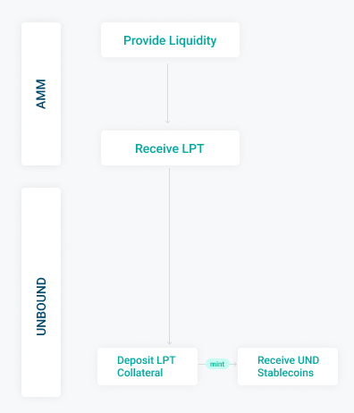
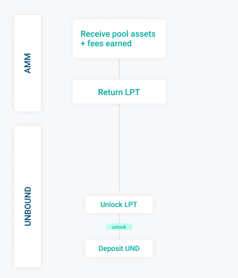

# Core Features

‌‌Unbound provides three main services in the form of fully automated Smart Contracts that do not require any third party intervention. The Smart Contracts make sure that the LPT pool is valid before a transaction can be created. Details regarding UND stablecoin are covered in the later section of the whitepaper.

### ‌Minting

‌Unbound's Minting feature enables users to deposit their LP tokens as collateral to mint UND stablecoins and other synthetic assets including uETH. At the initial stage, Unbound will issue UND loans to its users. With the addition of different collateral types, Unbound will launch uETH and other synthetic assets as loan issuance tokens.  

Initially, Unbound intends to support only the pools consisting of stablecoin pairs as collateral. Additional collateral types will be added later.

### Unlocking

‌Unbound enables users to unlock the underlying collateral upon repayment of borrowed funds including the minting fees. Unbound smart contracts are perpetual, meaning they don't have a maturity date on the money that has been minted, therefore there is no deadline for repayment of funds. UNDs paid back are burnt as a part of the unlocking process. This takes the minted UND out of circulation and in return the user gets back the leveraged assets. Unbound does not charge fees at the time of unlock.

It is possible for Unbound users to repay the total loan amount in separate portions, at separate times. Users are allowed to unlock assets equivalent to the amount paid back. At each instance, the smart contract calculates the amount of collateral to be unlocked by recalculating the collateralization ratio \(CR\) based on price feed from the price oracles. 

The complete collateral can be released by paying back the outstanding debt.

### Earn     

The Earn feature of the Unbound protocol incentivizes users for providing liquidity to the UND pools. Users can deposit UND in the Unbound liquidity pools. In return, they earn UND rewards on a continual basis proportional to the size of their deposit which gets accrued to the user balance. 

The deposit made to the liquidity pools can be withdrawn at any time including the rewards. Initially, Earn rewards are set to 60% of the minting fees. The current yield rate is variable and is susceptible to changes at later stages through community voting.

