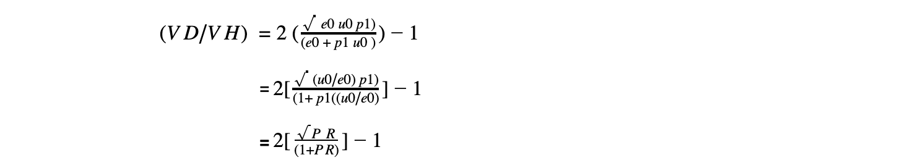
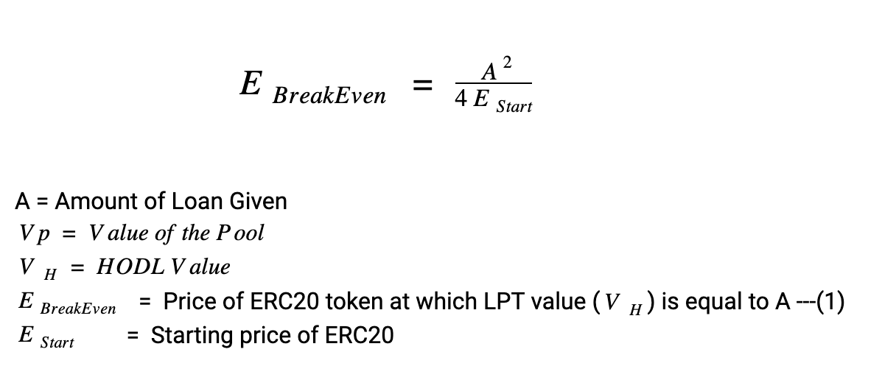
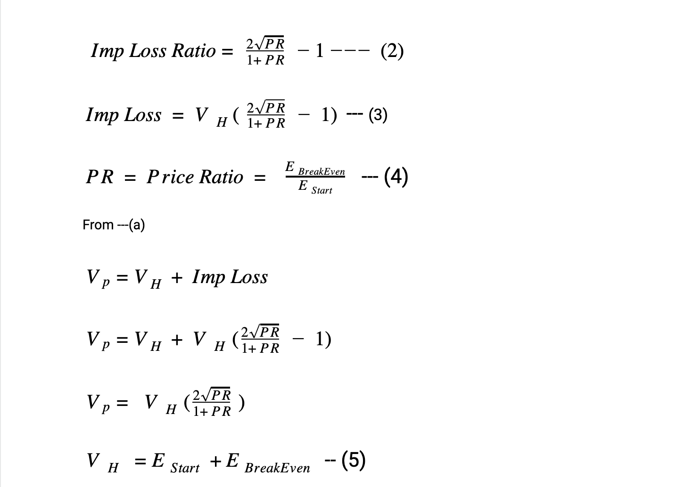
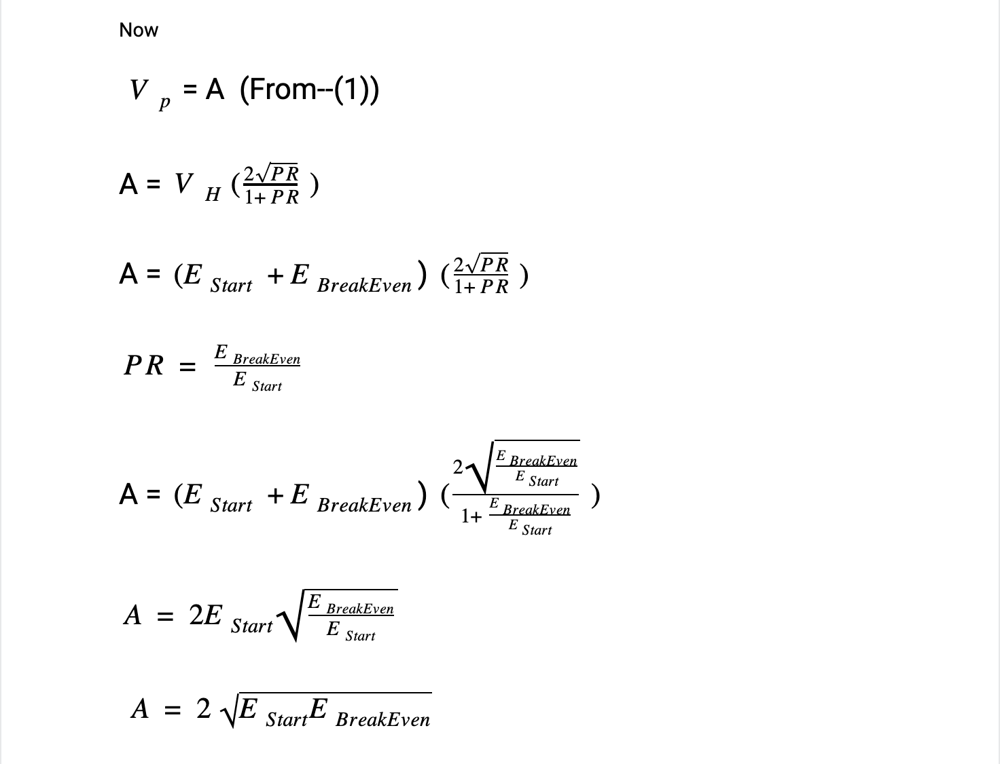
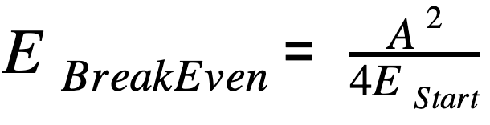

# Liquidation Free Liquidity

## Liquidation Free Liquidity

Liquidation Free Liquidity is a 2 step process

1. Lockup LPT tokens from large market cap pairs \(Eth/Dai,ETH/USDT,DAI/USDT, USDT/USDC, etc\)
2. A LTV ratio that does not risk the collateral even during steep corrections. 
3. Maintain a SAFU Fund that with time can act as an insurance fund. 

The most important part of using LPT tokens as a means of collateral is working out the impermanent or divergence loss that can erode the value of the collateral. To make it clearer, we would link the impairment loss in terms of the correction that the erc20 token will undergo in order to derive a breakeven price of the erc20 token with respect to the LTV.

### Deducing the formula for Impermanent loss 

#### Case 1 – HODL

A user holds e0 ETH and u0UND. He has equal values of the two \(measured in ETH, or equivalently in any other currency\). The initial price therefore is given by: p0=\(e0/u0\) 

And the initial value of the holdings \(measured in ETH\) is given by:

At some time in the future, the price has changed to p1, but the number of each token he holds \(e0 and u0\) is unchanged. So his holdings are now worth:

#### Case 2 - provide liquidity to Uniswap

Now, if he supplies his tokens to Uniswap, the constant product formula will work out how much ETH and UND he can claim from the liquidity pools, e1 and u1. In Uniswap, the ratio of the two pools is equal to the price of the two tokens:

So when the price changes to p1, we know that:

And from the constant product rule \(excluding fees\):

Combining these two we have:

So the value of the liquidity he can now withdraw from Uniswap is:

  
**Impermanent loss**  
We then find the difference between _`VH`_ \(the value from the hodl strategy\) with VU \(the value from the Uniswap strategy\) to work out the difference _`VD`_ . It's more useful to find this as a fraction of _`VH`_ so we divide both sides by _`VH`_.

To reframe this in terms of the price ratio PR\(price ratio\) = \(p1/p0\), we divide the top and bottom of the fraction by e0:

**Note**

The value of `(VD/VH)`will always be ≤ 0, showing that there is always a Impermanent loss  unless `(p1/ p0)=1, i.e. p1=p0)`  

The above was also used by uniswap for [understanding returns on their ecosystem](https://uniswap.org/docs/v2/advanced-topics/understanding-returns/).  

### Deducing Unbound breakeven formula or Meeth’s Formula

### Meeth’s Formula

Note: We have added the fees earned by LPT tokens by using the volume numbers disclosed by Uniswap.  

This formula is the foundation of our algorithm. To make things easier, we have created a [calculator](https://app.unbound.finance/calculator) that will process the Maths in the backend.  

For an ETH-DAI pair with an LTV of 50%, our net break-even price percentage is at - 74.9684%  

This means that in the above example with the current ETH price at $384.31, ETH would have to correct all the way to around $96 \(-75%\) for the underlying collateral to become 100% collateralized. 

You would also see Duration\(days\) in the [calculator](https://app.unbound.finance/calculator). This signifies the time it takes for the erc20 to decline in price and is required so that the fees that the LPT tokens earn can be calculated. These fees that are earned are then subtracted from Eth Break Even Price to get the Net BreakEven Price. 

### SAFU fund

The SAFU fund is an insurance fund that can be useful for blackswan events. The fund will continuously grow as a percentage of all the minting fees are allocated to it. This creates a continuous buying pressure on UND and helps maintain the dollar peg.  The % is set to 40% initially and set to change as the ecosystem develops.

