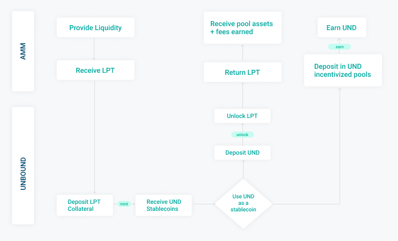

# Unbound - The DeFi Treasury For Liquidity Pool Tokens

Unbound is a DeFi platform that creates a treasury layer on top of existing AMM platforms by leveraging liquidity pools of Automated Market Makers. Unbound provides crypto users the first-ever debt-free liquidity provision system.

Key highlights of Unbound protocol are as follows :

* Debt - free : Borrowed funds are interest free creating a no debt position for users.
* Liquidation - free : Unbound does not have a liquidation Engine. As such users are free from the risk of their collateral being liquidated.
* Perpetual borrowing : Unbound loans do not mature. Users can unlock the underlying collateral at any time by repaying the loan.
* Stablecoin UND : UND is a cross-chain stablecoin, soft pegged to the US dollar which does not need to be stabilised.
* Factory Smart Contracts : Unbound uses Liquidity Lock contracts designed to be permissionless and supports EVM based AMMs like Uniswap, Balancer, Mooniswap, DFYN, SushiSwap etc. Support for Non-EVM based AMMs will be launched soon.
* Minting cross chain synthetic assets : Unbound will make use of oracles and native bridges to perform cross chain transfers of UND and other synthetic assets.
* Secured Price Oracles : Unbound uses a combination of Uniswap’s TWAP and Chainlink to obtain highly secured price feed providing security to the platform against flash attacks and also reduces dependency on a single price oracle. 

The Unbound platform is built on the Ethereum blockchain. It has been integrated with other multichain networks including Binance Smart Chain, Polygon and Harmony. Current Factory Smart Contract supports Liquidity Pool tokens from EVM based AMMs that include Uniswap, SushiSwap, PancakeSwap, DFYN, Balancer, Mooniswap, Bancor etc. Non-EVM based AMMs will be launched soon.

