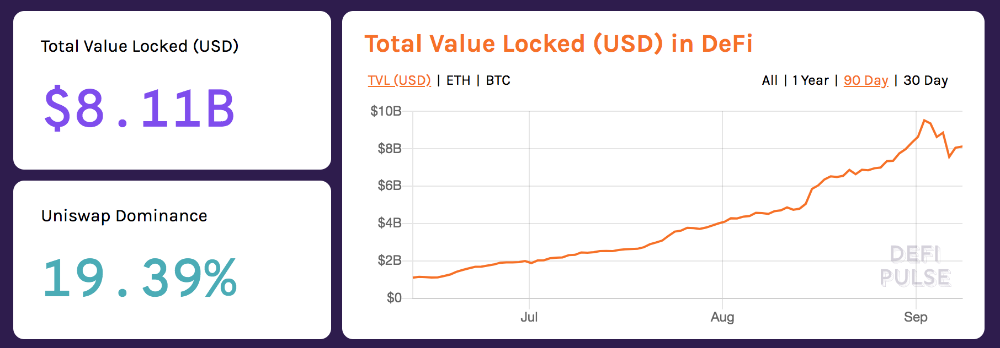

# Unlocking Liquidity

Unbound provides a DeFi treasury for Liquidity Pool Tokens \(LPT\). In September 2020, the overall value of USD locked in the DeFi space was valued at $8.11B.

There is huge potential in this space for liquidity. Much of the funds however, are locked in smart contracts which have no other potential other than accumulating yields. That works well for many users, but some would like to explore other ways to make use of their digital assets while it is locked in a smart contract.

Unbound provides a way to unlock LPT for those who need funds for other liquidity purposes. This is done through a mint process that is facilitated by our platform. Users deposit their LPT to an Unbound smart contract and in return will receive the amount of funds based on their token pairing. 

When a user wants to reclaim their LPT, all they must do is unlock the Unbound token through a burning process. This will return the LPT back to the user. Digital assets are never liquidated as long as they are stored in our Vault mechanism. Users can still reclaim their LPT as long as they are able to pay back what they owe.


Liquidity is about providing funds for loans and swaps on a decentralized exchange. Users who lock their token pairs in a Liquidity Pool are Liquidity Providers. They earn from a percentage of the pool, based on their overall contribution to it.


