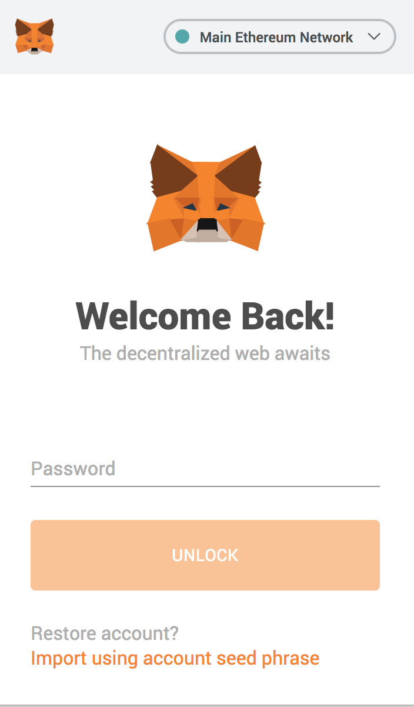

# Wallet

Before using the Unbound app, you must have a digital wallet that contains a private key. The wallet does not actually store any funds, but is a DApp \(Distributed Application\) that connects to the blockchain to retrieve information about your funds. The private key, which is unique to your wallet, is what allows you to view this information. Only you can view this information through the use of the private key, so never share or give the private key to others. 

We support wallets that comply with Injected Web3 standards like **Metamask**. The Metamask wallet is an extension that is installed in the Chrome browser.

Install the extension for [Metamask](https://metamask.io/) first. Their website contains a link to download the extension or you can also go to the Google Playstore to install the extension \(search for Metamask\). 

This Metamask website also contains [detailed instructions](https://metamask.io/faqs.html) on how to install the wallet along with an FAQ section. 

Once you have the extension installed, you can connect your wallet to our app and begin unlocking your liquidity. You will now have your own public address which is what identifies your wallet for transactions. It is like your account number on the blockchain. An example wallet address that you will have looks like the following:

**0x1030351d9a46f002ddaF908B7476F534813FdD8C**

After installing the wallet, you must also have ETH \(Ether\). Purchasing cryptocurrency must be done through your [digital exchange](https://en.wikipedia.org/wiki/Cryptocurrency_exchange) if you do not have any. Please visit exchanges \(BInance, Coinbase, Kraken, etc.\) to begin the process. Once you have Ether, it will appear inside your wallet like having funds in a bank account.

