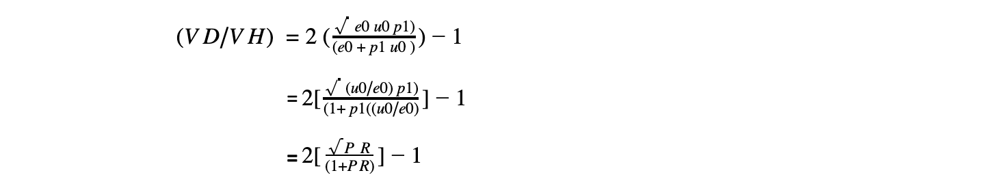
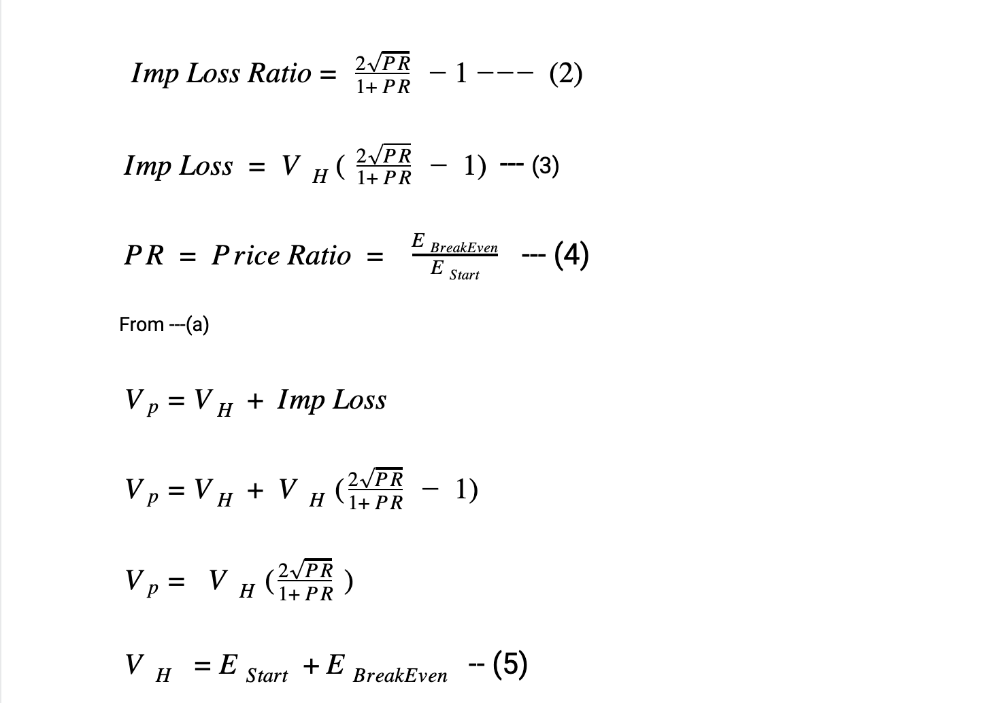

# No Liquidations in Unbound Explained

Unbound enables the minting of synthetic assets by locking up existing liquidity pool tokens of various DeFi AMMs. A liquidation engine is required when the value of collateral reduces and the value begins to threaten the recovery of the capital loaned. In crypto traditional assets that are used for collateral like ETH, BTC or any large cap coins would need to be liquidated at corrections of about 40% but we use LPTs that proved to be a lot more stable in similar circumstances. \

Now since we talked about proof then that's exactly what we plan to do by \

1. Using Mathematical Formulas to determine the impact of corrections. &#x20;
2. Decompiling Uniswap Smart Contracts and run simulations on the local blockchain to cross check the results.&#x20;

This article will be focussed on Maths and formulas. \

We would need to understand Impermanent Loss before we move any further since in Automated Market Makers, Impermanent loss is the one that causes loss in value and can be a factor to consider liquidations. Impermanent loss is the difference between the value of holding the assets in comparison to value when they are in a liquidity pool. The concept is covered in depth [here](https://pintail.medium.com/uniswap-a-good-deal-for-liquidity-providers-104c0b6816f2) \

The first version of Unbound will feature Uniswap LPTs from ERC20-Stablecoin pairs such as ETH-Dai, ETH-USDT, etc. These represent stablecoin and ETH in equal ratio, so in simplest terms at 50% loan to value we are minting the value equivalent to the stablecoin keeping ETH as collateral. For example 20 LPT represent $1000, which means $500 will be in ETH and $500 will be a stablecoin. Now when $500 is minted into a our stablecoin keeping $500 in ETH as collateral. Once we understand this part  we do realize that during corrections it's the Impermanent loss  that risks our financial model as in it’s absence we would never be undercollateralized even if ETH goes to zero. \

The next step would be to mathematically figure out the Impermanent loss  in the pools and link it to a breakeven price of ETH in such circumstances. \

### Deducing the formula for Impermanent loss&#x20;

#### Case 1 – HODL

A user holds e0 ETH and u0UND. He has equal values of the two (measured in ETH, or equivalently in any other currency). The initial price therefore is given by: p0=(e0/u0)&#x20;

And the initial value of the holdings (measured in ETH) is given by:

At some time in the future, the price has changed to p1, but the number of each token he holds (e0 and u0) is unchanged. So his holdings are now worth:

#### Case 2 - provide liquidity to Uniswap

Now, if he supplies his tokens to Uniswap, the constant product formula will work out how much ETH and UND he can claim from the liquidity pools, e1 and u1. In Uniswap, the ratio of the two pools is equal to the price of the two tokens:

So when the price changes to p1, we know that:

And from the constant product rule (excluding fees):

Combining these two we have:

So the value of the liquidity he can now withdraw from Uniswap is:

\
**Impermanent loss**\
****We then find the difference between _`VH`_ (the value from the hodl strategy) with VU (the value from the Uniswap strategy) to work out the difference _`VD`_ . It's more useful to find this as a fraction of _`VH`_ so we divide both sides by _`VH`_.

To reframe this in terms of the price ratio PR(price ratio) = (p1/p0), we divide the top and bottom of the fraction by e0:

**Note**

The value of `(VD/VH)`will always be ≤ 0, showing that there is always a Impermanent loss  unless `(p1/ p0)=1, i.e. p1=p0)`

### Deducing Unbound breakeven formula or Meeth’s Formula

### Meeth’s Formula

Note: We have added the fees earned by LPT tokens using volume numbers disclosed by Uniswap.

This formula is the foundation of our algorithm. To make things easier, we have created a [calculator](https://app.unbound.finance/calculator) that will process the Maths in the backend. There is also an input for the number of days that will help to calculate the fees that the LPT will earn during the time we expect the ETH to correct and is deducted from the breakeven price to get the Net Breakeven Price.&#x20;

For an ETH-DAI pair with an LTV of 50%, our Net Break-Even Price Percentage is at - 74.9684%\

.png>)

This means that in the above example with the current ETH price at $444.73, we can allow ETH to fall by - 75% to $111.18. It is at this point other protocols start liquidating collaterals. Unbound does not do so. We use our SAFU fund to keep your collateral safe.\
\
\
\
\
\
\
