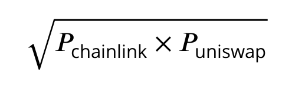
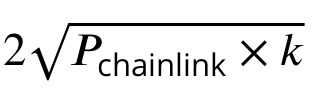

# Price Oracle Solution for Unbound

Oracle is the heart of the Defi ecosystem and one that is most vulnerable to manipulation. We started with uniswap reserve ratios as the only source of price discovery, but we quickly realized our folly and the hack of compound reiterated the mistake of relying on single price feed. Following are some of the approaches we tried 

 **1. Uniswap’s Time Weighted Average Price \(TWAP\) oracle :** TWAP is the simple way to use an  AMMs as a price oracle. We analyzed that this approach is unsuitable for our protocol as It’s a  lagging indicator that becomes out of sync during the time of moderate to high volatility. Also  our analysis says it is more suitable once the protocol reaches a high transaction volume so  the public variable to store price gets regularly updated. Hence unsuitable for our approach  at launch. 

 **2. Chainlink** : It is a robust and secure approach for price feed with respect to security, accuracy  and decentralization. Only challenge here was to not rely solely on its price feed and figure  out a way to jointly use it with uniswap reserves. 

 **3. Using ChainLink and Uniswap together with comparaison :** This required comparing the price  at any given block and reverting the transaction if the delta is beyond a pre-decided value,  let’s say 5%. This was certainly not scalable and very gas inefficient since it reverts the trans  actions. 

 **4. Geometric Mean The Solution We Freezed Upon:** This was our saviour and a solution which  is both scalable and can be used for cross chain implementation. The simple logic is we compare prices coming from Uniswap and Chainlink to find deviations. If the deviation is within the accepted limit then the price calculation will be done by using Arithmetic mean. However, if the deviation is more than the acceptable limit then the price calculation will be  done using weighted geometric mean. But let’s find out why geometric mean\(GM\). 

A Geometroc Mean  is  :  

Under this valuation the value of the pool becomes   where k is the invariant of a Uniswap pool. This means the value remains invariant of the activity within the pool and depends primarily on the price variations in Chainlink. In case the Chainlink price gets manipulated, Geometric Mean\(GM\) still helps to better normalize it than Arithmetic mean since a property GM of two numbers will always yield a result that is closer to the smaller number.

