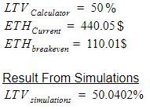

# Simulating Impermanent Loss

The goal of this article is to calculate impermanent loss by simulating the price drop in ETH for an ETH-Dai pool using Uniswap Contracts. Using the [Calculator](https://testnet.unbound.finance/calculator) we are able to figure out the breakeven price of ETH.

.png>)

The breakeven price of ETH is the price at which the impermanent loss causes the value of loan amount equivalent to the value of LPT tokens locked.

.png>)

Hence if we simulate the price drop of ETH to the breakeven price the ratio of the LPT values at start and end, should be equal to the LTV value we used in the [Calculator](https://testnet.unbound.finance/calculator) to prove the Eth breakeven price derived from the [Meeth’s Formula](https://docs.google.com/document/u/1/d/1wR1QhUiZ1kjHnai35de9F5bh-fes0\_0bllV13QZzR2s/edit).

We could have run these simulations either on the Kovan Testnet or by decompiling Uniswap’s Smart Contracts to work with our [local blockchain node](https://www.trufflesuite.com/ganache). The latter option was faster and helped us test multiple data points quickly. We plan to configure a CMD tool for these simulations and open it up for community testing.

Again the  [Calculator LTV](https://testnet.unbound.finance/calculator/)  should be equal to the LTV from our test script after simulating the price drop of ETH to break-even price.

Step 1 We deploy the simulations repo with the Ganache Blockchain Node running in the background.

Step 2 We use the Calculator for the ETH-DAI pair.

Step 3 The LTV we selected was 85%. The start price is $440.25 and the breakeven price of the ETH is $340.93 (Not accounting for Fees Earned)

Step 4 We now head to the Simulation Script.&#x20;

Step 5 We would now simulate the price drop.&#x20;

Step 6 For our Math results and Simulations to Match.

.png>)

**Simulation #1**

.png>)



**Simulation #2**

.png>)



**Simulation #3**



\
\
&#x20;\
