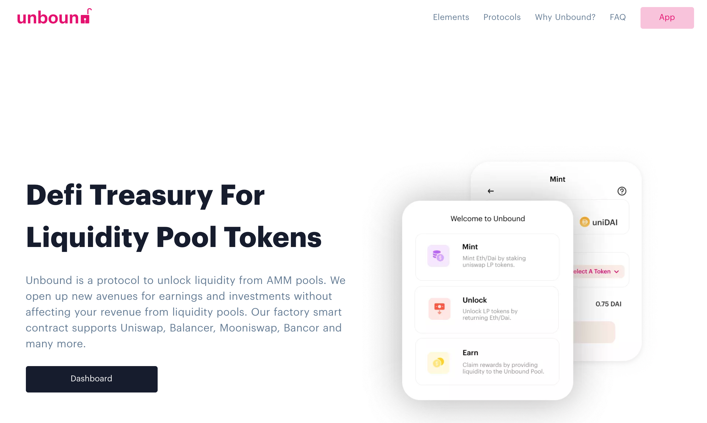
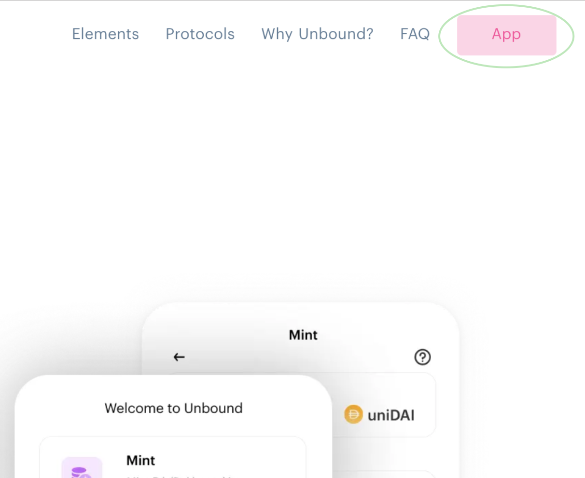
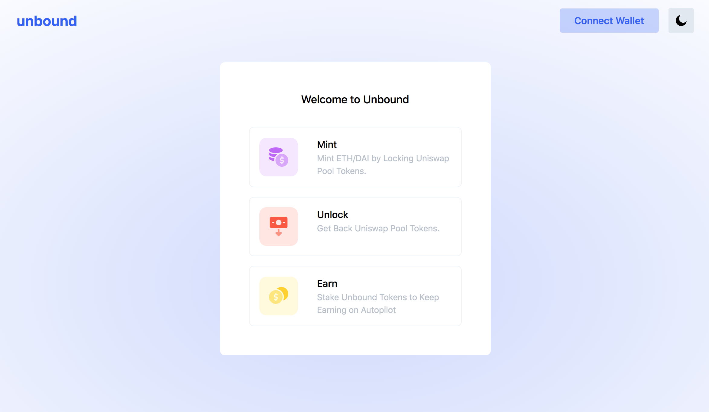

# Using The App

The requirements to access the app are:

* [Chrome](https://www.google.com/chrome/) web browser
* [Metamask](https://metamask.io/) wallet extension for Chrome

There are 2 ways to access the Unbound app.

1. Follow the URL for Unbound \([click here](https://unbound.finance)\).

From your smartphone or mobile, scan the following QR code:

You will be taken to our main website. If your phone does not support the URL from the browser, switch to a desktop or laptop computer using the link or follow step 1.

\_\_\_\_\_\_\_\_\_\_\_\_\_\_\_\_\_\_\_\_\_\_\_\_\_\_\_\_\_\_\_\_\_\_\_\_\_\_\_\_\_\_\_\_\_\_

Now click the App button on the top right corner of the website to begin using the app.

Now you are ready to begin once you reach the main dashboard of the app.

Welcome to the Unbound app, you are now ready to begin.

