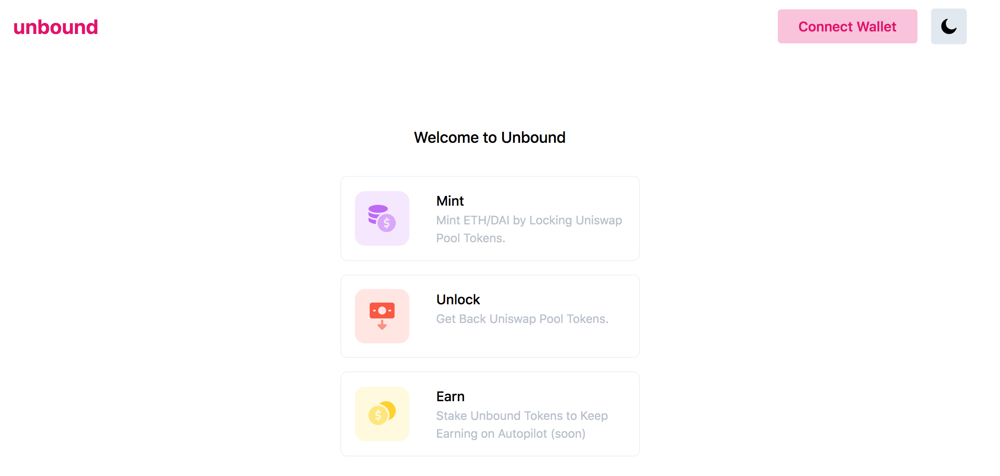
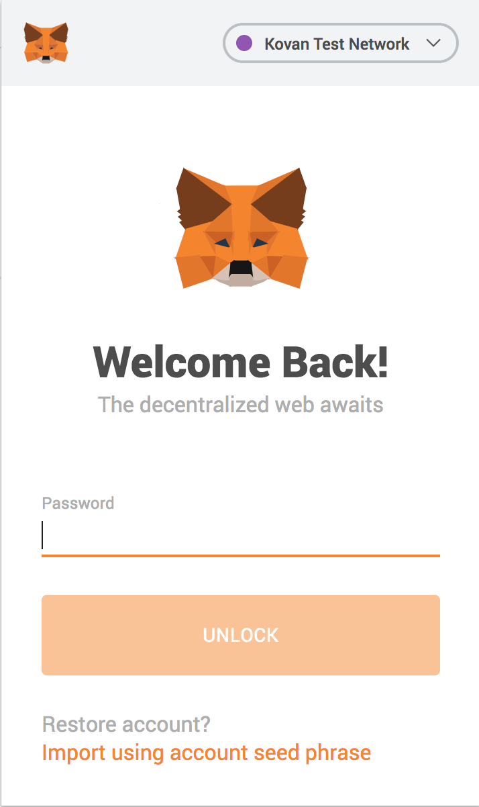
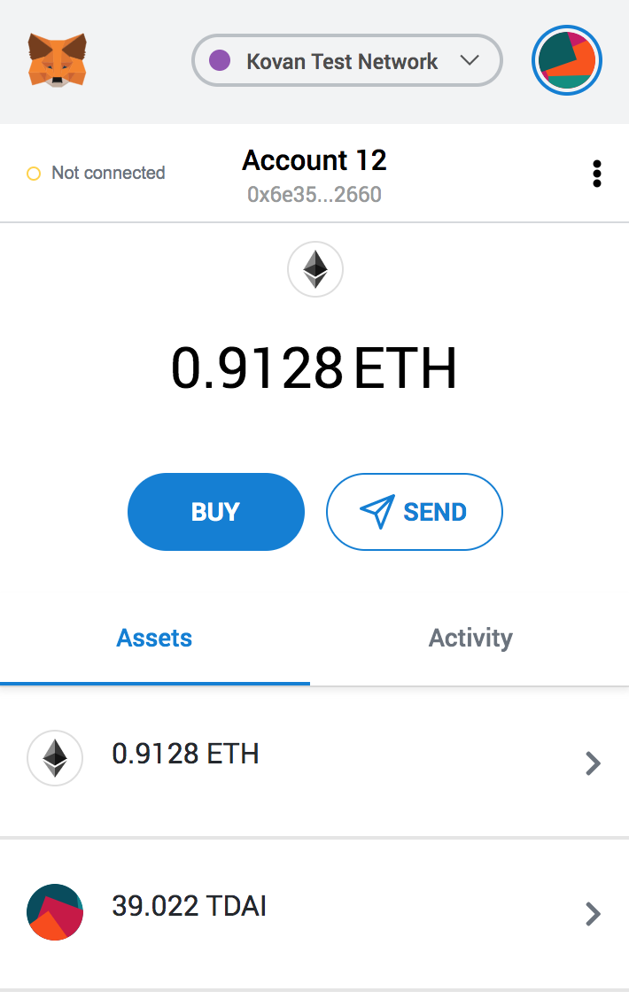
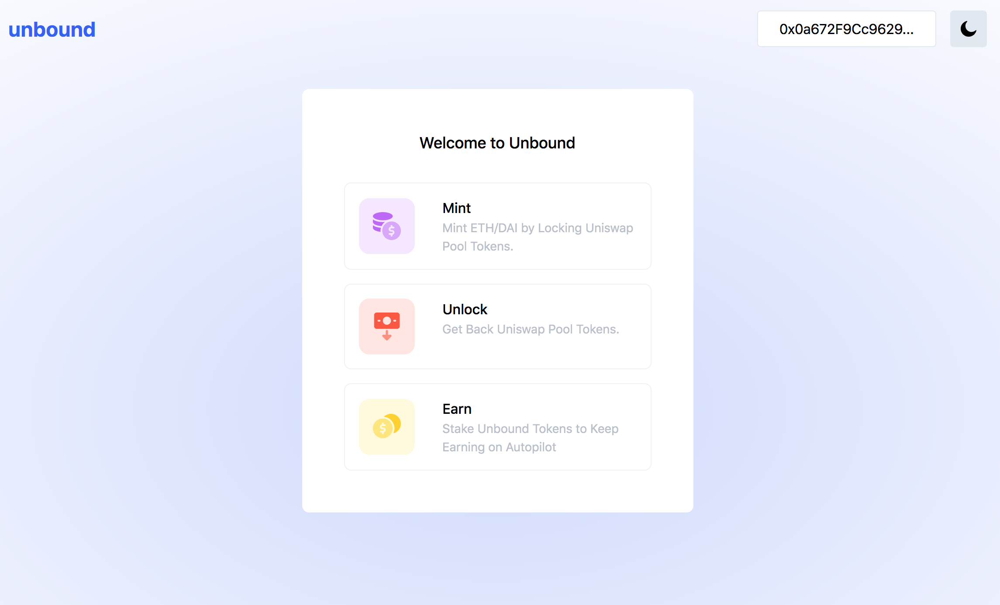

# Connecting Your Wallet

Once you open the app, you must connect your wallet.

Click the 'Connect Wallet' button on the top right corner. \(Note: Next to the 'Connect Wallet' button is a _**dark mode option**_ for those who prefer this setting\). This wallet will connect the app to the Ethereum blockchain to access your funds.

If you do not have your wallet unlocked, you must do so first \(for Metamask you must enter your password\). Make sure also from the wallet _**networks**_ option that you select the **Kovan Test Network** to connect to the blockchain.

Login to your Metamask wallet by typing your password. You should then be able to see your wallet account and funds.

Your screen should now display your Ethereum address in the top right corner.

Now that your wallet is connected, you can start using the app's features. Before we can do that though, you must fund yourself with tokens from our [faucet](getting-tokens.md).

