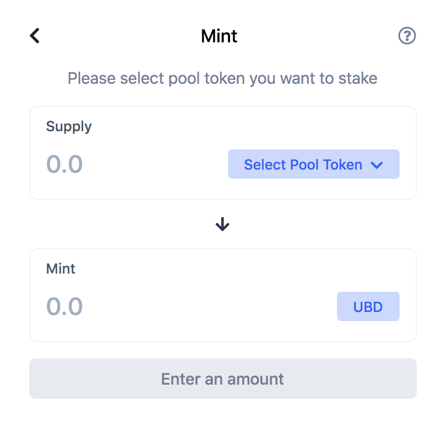

# Mint Your Tokens

You mint tokens \(UND\) when you deposit your LPT \(Liquidity Pool Token\) to the platform. This locks the LPT to our smart contract as collateral for personal funding. You will be issued the UND token, which is a stablecoin. There are no requirements to obtain the tokens other than providing collateral. Your collateral is your LPT . Look for the supported LPT from the list of supported pools. 

To begin minting, follow these steps:

### Click or select the Mint feature

You will now be able to supply your LPT.

From the **'Select Pool Token'** option, you can select the supported token pair of your LPT. 

Once you select your LPT, you can indicate the amount you want to supply.

 A minting fee will be charged for the tokens. This rate is set to 50% of your collateral. By clicking 'Mint', your LPT is deposited and locked into a smart contract and you will receive your UND tokens. You can find the tokens in your wallet once the transaction has been processed.

