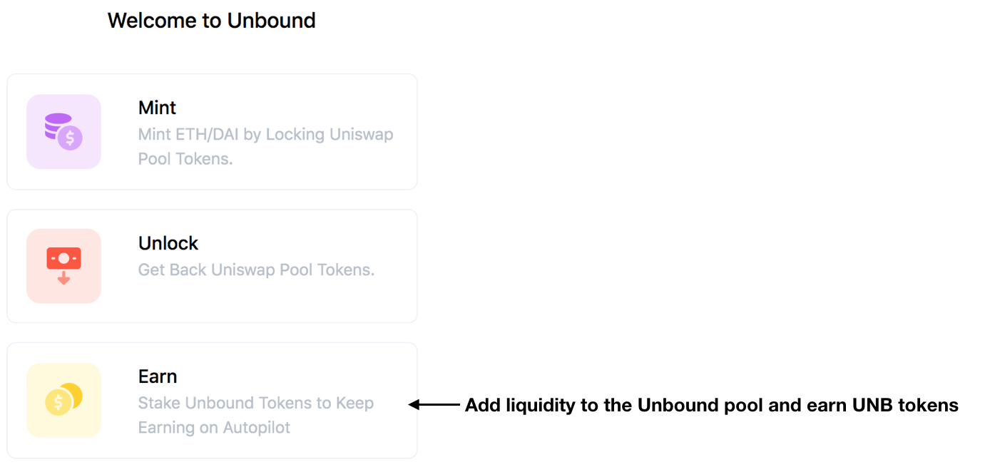
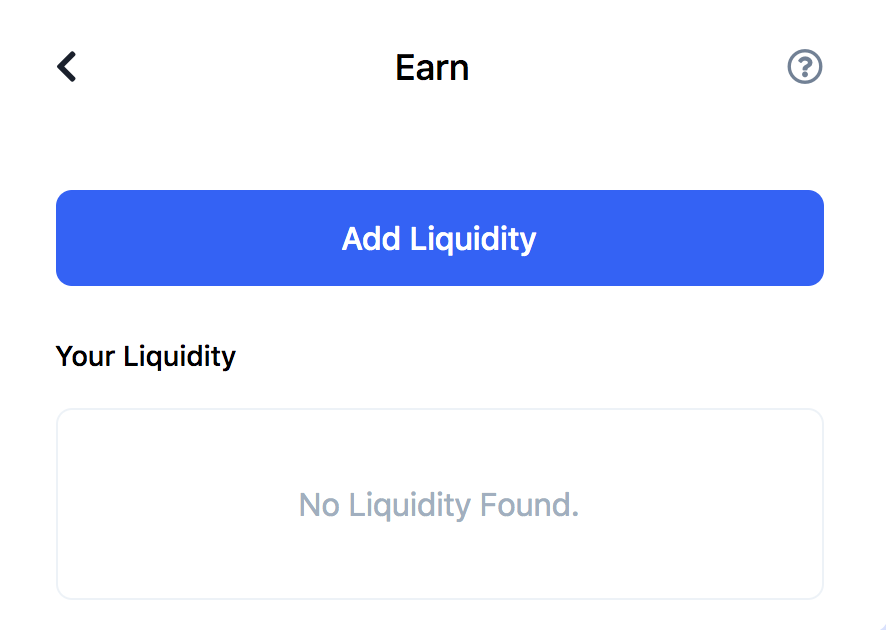
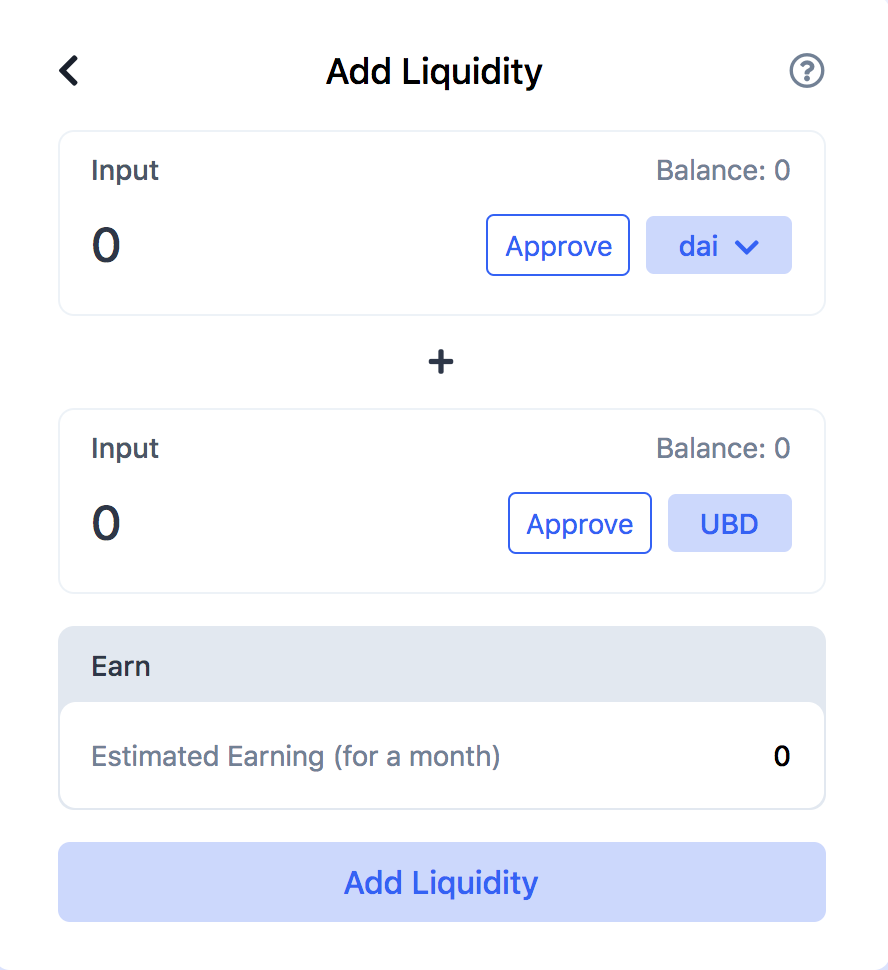

# Earn

Unbound.Finance gives Liquidity Providers an incentive for providing liquidity to its own pool. The chance to earn here are from transaction fees on the pool. Users will be issued with the UNB token, which is also the governance token of the platform. This will allow token holders to participate in the policy making and operations of the platform through a community-led consensus market-driven approach.

To start earning on the pool, select **'Add Liquidity'**.

The next screen will give users the option to add liquidity token pairs supported on the pool. 

Once the token pair has been selected, the amount of input that was indicated is added to the pool and in return the user will receive their UNB tokens.

