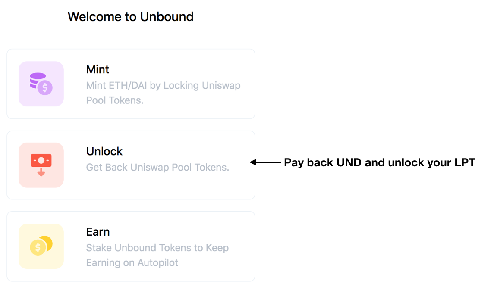
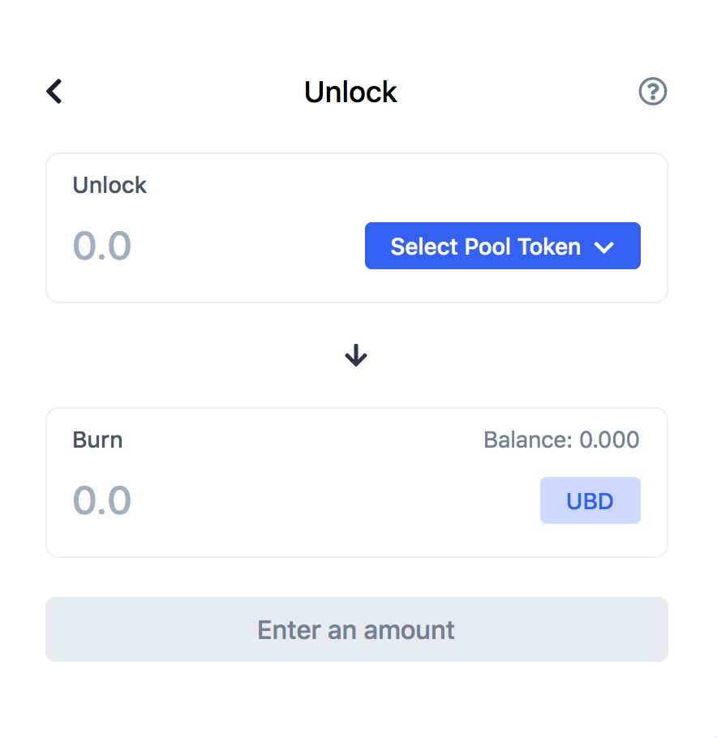
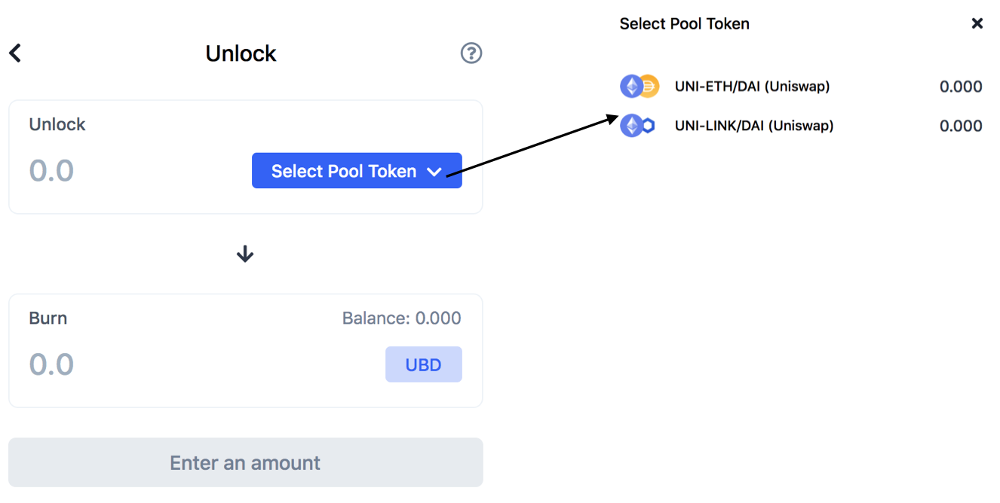
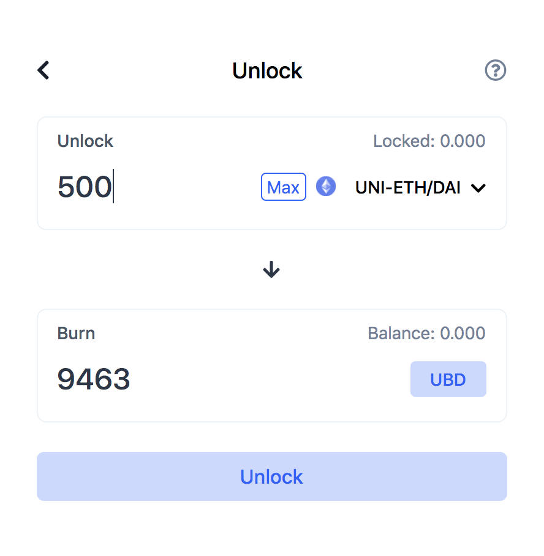

# Unlock Your LPT

When a participant is ready to pay back the funds they borrowed, they select the Unlock feature on the Unibound app. This takes them to a familiar screen \(for those who had minted already\). This time around you are getting back what you locked in a smart contract.

### Click or select the Unlock feature

You will now be able to select the LPT pair type you had deposited from **'Select Pool Token'**. Then specify the amount that you want to unlock from your deposit.

You can choose the maximum amount of UND that you want to pay back. This is the "burn" process and it will give back the amount of LPT you indicate.

There are burn fees or additional costs when paying back UND. This is basically a feeless return of your collateral once you pay back the funds that had been borrowed.

